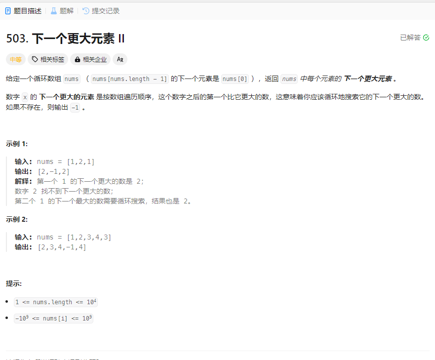

# 503. 下一个更大元素 II
## 题目链接  
[503. 下一个更大元素 II](https://leetcode.cn/problems/next-greater-element-ii/description/)
## 题目详情


***
## 解答一
答题者：EchoBai

### 题解
循环查找即可，竟然没超时，震惊！！！。

### 代码
``` cpp
class Solution {
public:
    vector<int> nextGreaterElements(vector<int>& nums) {
        vector<int> res;
        for(int i = 0; i < nums.size(); ++i){
            res.emplace_back(findNext(nums,i));
        }
        return res;
    }
    int findNext(vector<int> &nums, int idx){
        int res = -1;
        int i = 0;
        for(i = idx + 1; i < nums.size(); ++i){
            if(nums[i] > nums[idx]){
                return nums[i];
            }
        }
        for(i = 0; i < idx; ++i){
            if(nums[i] > nums[idx]){
                return nums[i];
            }
        }
        return res;
    }
};
```

> 循环栈加上单调栈，参考官方（练习单调栈解法）
```c++
class Solution {
public:
    vector<int> nextGreaterElements(vector<int>& nums) {
        int size = nums.size();
        vector<int> res(size, -1);
        std::stack<int> st;
        for(int i = 0; i < size * 2 - 1; ++i){
            while(!st.empty() && nums[i % size] > nums[st.top()]){
                res[st.top()] = nums[i % size];
                st.pop();
            }
            st.push(i % size);
        }
        return res;
    }
};
```


