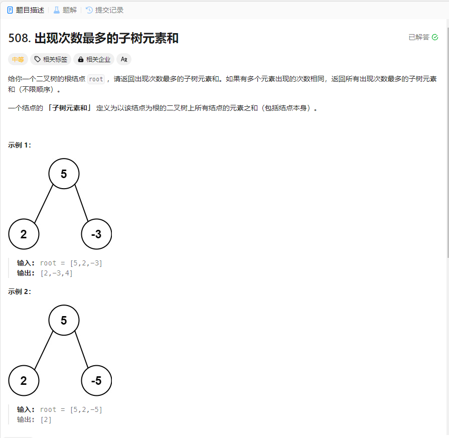

# 508. 出现次数最多的子树元素和
## 题目链接  
[508. 出现次数最多的子树元素和](https://leetcode.cn/problems/most-frequent-subtree-sum/description/)
## 题目详情


***
## 解答一
答题者：EchoBai

### 题解
先用递归将子树元素和和其出现次数统计到一个`map`中，同时记录最大出现次数，然后遍历`map`将最大次数元素放入结果数组即可。

### 代码
``` cpp
/**
 * Definition for a binary tree node.
 * struct TreeNode {
 *     int val;
 *     TreeNode *left;
 *     TreeNode *right;
 *     TreeNode() : val(0), left(nullptr), right(nullptr) {}
 *     TreeNode(int x) : val(x), left(nullptr), right(nullptr) {}
 *     TreeNode(int x, TreeNode *left, TreeNode *right) : val(x), left(left), right(right) {}
 * };
 */
class Solution {
public:
    vector<int> findFrequentTreeSum(TreeNode* root) {
        map<int,int> mp;
        vector<int> ans;
        if(!root) return ans;
        int maxTimes = 0;
        computeValue(root,mp,maxTimes);
        for(auto m : mp){
            if(m.second == maxTimes)
                ans.emplace_back(m.first);
        }
        return ans;
    }
    int computeValue(TreeNode* root, map<int,int> &mp, int &maxTimes){
        if(!root) return 0;
        int value = root->val + computeValue(root->left,mp,maxTimes) + computeValue(root->right,mp,maxTimes);
        ++mp[value];
        maxTimes = max(maxTimes,mp[value]);
        return value;
    }
};
```


