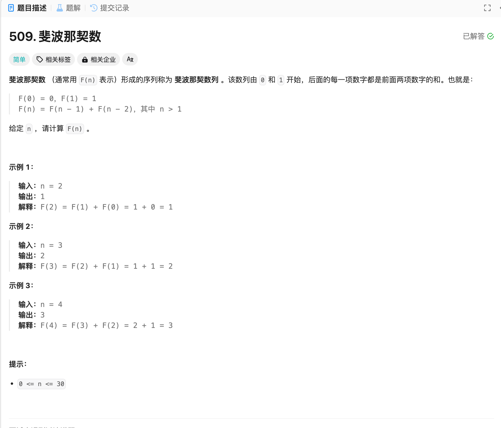

# 509. 斐波那契数
## 题目链接  
[509. 斐波那契数](https://leetcode.cn/problems/fibonacci-number/)
## 题目详情


***
## 解答一
答题者：EchoBai

### 题解
根据定义递推即可。

### 代码
``` cpp
class Solution {
public:
    int fib(int n) {
        // std::vector<int> fbArray(31, 0);
        // fbArray[0] = 0;
        // fbArray[1] = 1;

        // for(int i = 2; i <= 30; ++i){
        //     fbArray[i] = fbArray[i-1] + fbArray[i-2];
        // }
        int dp0 = 0;
        int dp1 = 1;
        if(n <= 1) return n;
        for(int i = 2; i <= n; ++i){
            int sum = dp0 + dp1;
            dp0 = dp1;
            dp1 = sum;
        }

        return dp1;
    }
};
```


