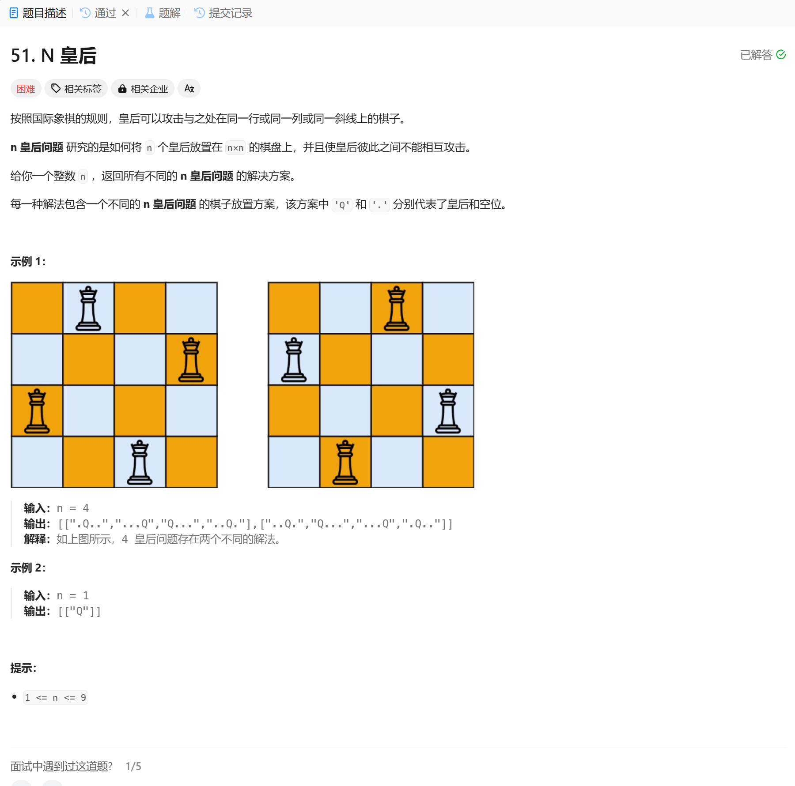

# 51. N 皇后
## 题目链接  
[51. N 皇后](https://leetcode.cn/problems/n-queens/description/?envType=daily-question&envId=2024-12-01)
## 题目详情


***
## 解答一
答题者：EchoBai

### 题解
题解简单，自己想不到，这辈子丸啦！

### 代码
``` cpp
class Solution {
    vector<vector<string>> result;
public:
    vector<vector<string>> solveNQueens(int n) {
        std::vector<std::string> chessboard(n, std::string(n, '.'));
        backtracking(0, n, chessboard);
        return result;
    }

    void backtracking(int row, int n, vector<string>& chessboard){
        if(row == n){
            result.push_back(chessboard);
            return;
        }

        for(int col = 0; col < n; ++col){
            if(isValid(row,col,chessboard, n)){
                chessboard[row][col] = 'Q';
                backtracking(row + 1, n, chessboard);
                chessboard[row][col] = '.';
            }
        }
    }

    bool isValid(int row, int col, const vector<string>& chessboard, int n){
        // 检查列是否有
        for(int i = 0; i < row; ++i){
            if(chessboard[i][col] == 'Q'){
                return false;
            }
        }
        
        // 检查主对角线是否有
        for(int i = row - 1, j = col - 1; i >= 0 && j >= 0; --i, --j){
            if(chessboard[i][j] == 'Q'){
                return false;
            }
        }

        // 检查辅对角线是否有
        for(int i = row - 1, j = col + 1; i >= 0 && j < n; i--, j++) {
            if (chessboard[i][j] == 'Q') {
                return false;
            }
        }
        return true;
    }
};
```
