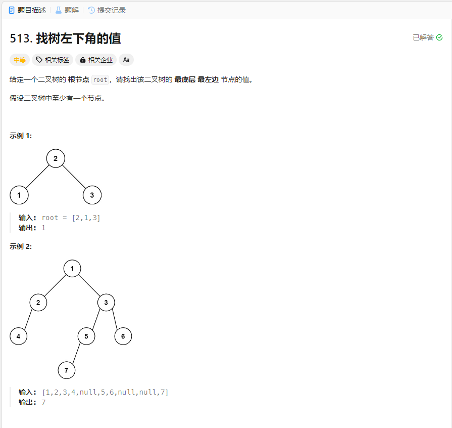

# 513. 找树左下角的值
## 题目链接  
[513. 找树左下角的值](https://leetcode.cn/problems/find-bottom-left-tree-value/description/)
## 题目详情


***
## 解答一
答题者：EchoBai

### 题解
最左下角其实就是层序遍历最后一层的第一个元素，那么我们只需要按照层序遍历将每一层第一个元素入栈，最后取栈顶元素即可。

### 代码
``` cpp
/**
 * Definition for a binary tree node.
 * struct TreeNode {
 *     int val;
 *     TreeNode *left;
 *     TreeNode *right;
 *     TreeNode() : val(0), left(nullptr), right(nullptr) {}
 *     TreeNode(int x) : val(x), left(nullptr), right(nullptr) {}
 *     TreeNode(int x, TreeNode *left, TreeNode *right) : val(x), left(left), right(right) {}
 * };
 */
class Solution {
public:
    int findBottomLeftValue(TreeNode* root) {
        stack<int> sk;
        levelOrder(root,sk);
        return sk.top();
    }
    void levelOrder(TreeNode* root,stack<int> &sk){
        if(!root) return;
        queue<TreeNode*> q;
        q.push(root);
        while(!q.empty()){
            int size = q.size();
            int cnt = 1;
            for(int i = size; i > 0; --i){
                TreeNode *e = q.front();
                if(cnt){
                    sk.push(e->val);
                    --cnt;
                }
                q.pop();
                if(e->left) q.push(e->left);
                if(e->right) q.push(e->right);
            }
        }
    }
};
```


