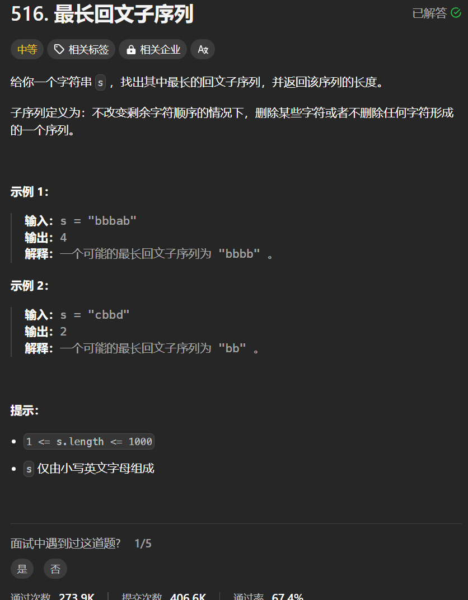

# 516. 最长回文子序列
## 题目链接  
[516. 最长回文子序列](https://leetcode.cn/problems/longest-palindromic-subsequence/description/)
## 题目详情


***
## 解答一
答题者：**Yuiko630**

### 题解
>定义:dp[i][j]表示子串[i,j]内最长回文子序列长度
>2. 转移方程:
>>if(s[i] == s[j]) dp[i][j] = dp[i+1][j-1]+2; // 相同则往前后扩1
>>else
>>dp[i][j] = max(dp[i+1][j], dp[i][j-1]) // 不同则往前减1和往后减1当中选最大的
>3. 初始化:对角线是自己到自己一个字符一定是回文子序列，初始化为1
>4. 遍历:外层循环i从s.length-1到0，内层循环j从i+1-s.length-1
>5. 推导

### 代码
``` Java
class Solution {
    public int longestPalindromeSubseq(String s) {
        int[][] dp = new int[s.length()][s.length()];
        for (int i = 0; i < s.length(); i++) dp[i][i] = 1;
        for(int i = s.length() - 1; i>= 0; i--){
            for(int j = i+1; j < s.length(); j++){
                if(s.charAt(i) == s.charAt(j)) {
                    dp[i][j] = dp[i+1][j-1] + 2;
                }
                else{
                    dp[i][j] = Math.max(dp[i+1][j], dp[i][j-1]);
                }
            }
        }
        return dp[0][s.length()-1];
    }
}
```