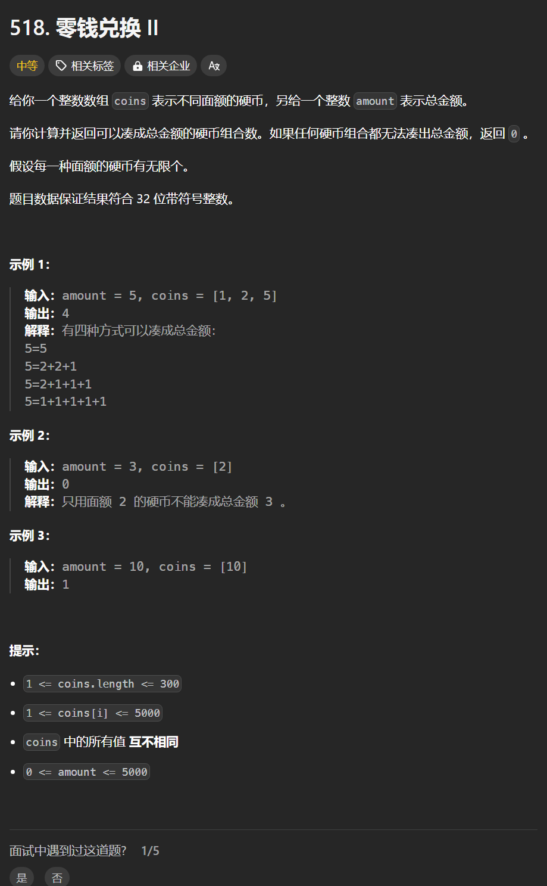

# 518. 零钱兑换II
## 题目链接  
[518. 零钱兑换II](https://leetcode.cn/problems/coin-change-ii/description/)
## 题目详情


***
## 解答一
答题者：**Yuiko630**

### 题解
>dp，五部曲
>1. 定义:dp[j]表示凑成面额j有dp[j]种方法
>2. 转移方程:dp[j] += dp[j-coins[i]]
>3. 初始化:dp[0]=1，凑成面额0只有一种方法就是什么也不凑
>4. 遍历:外层遍历coins，内层正序遍历金额
>5. 推导

### 代码
``` Java
class Solution {
    public int change(int amount, int[] coins) {
        int[] dp = new int[amount + 1];
        dp[0] = 1;
        for(int i = 0; i < coins.length; i++){
            for(int j = coins[i]; j <= amount; j++){
                dp[j] += dp[j - coins[i]];
            }
        }
        return dp[amount];
    }
}
```