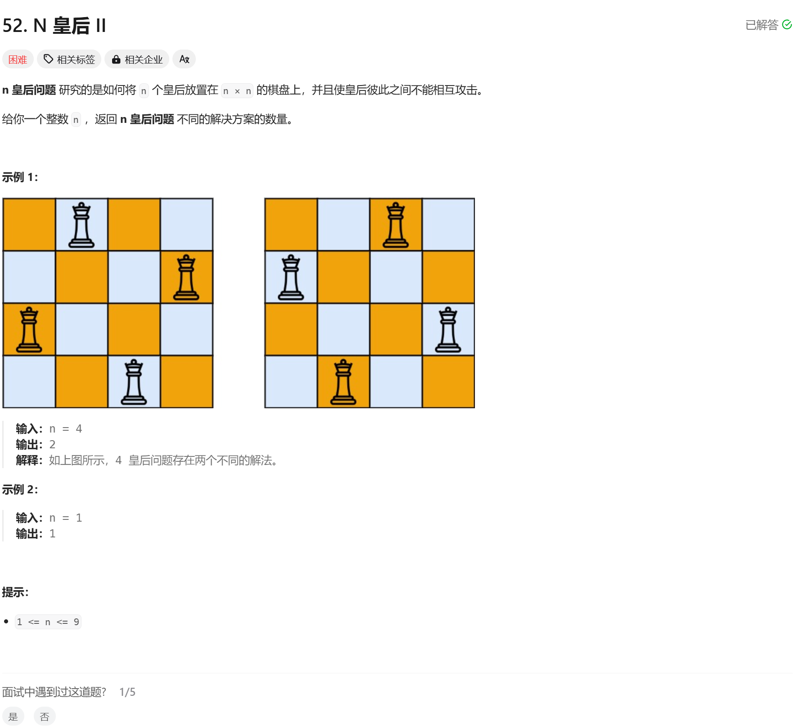

# 52. N 皇后 II
## 题目链接  
[52. N 皇后 II](https://leetcode.cn/problems/n-queens-ii/description/)
## 题目详情


***
## 解答一
答题者：EchoBai

### 题解
主要思路同51，这里其实就结果不需要返回具体摆法，只需要返回满足条件的个数即可，用一个变量记录就行。回溯部分可以理解，其实主要注意的点就是不要忘记检查辅对角线。

### 代码
``` cpp
class Solution {
public:
    int totalNQueens(int n) {
        std::vector<std::string> chessboard(n, std::string(n,'.'));
        int res = 0;
        backtraceing(n, 0, chessboard, res);
        return res;
    }

    void backtraceing(int n, int row, vector<string>& chessboard, int& res){
        if(row == n){
            ++res;
            return;
        }
        for(int col = 0; col < n; ++col){
            if(isValid(row, col, n, chessboard)){
                chessboard[row][col] = 'Q';
                backtraceing(n, row + 1, chessboard, res);
                chessboard[row][col] = '.';
            }
        }
    }

    bool isValid(int row, int col, int n, const std::vector<std::string>& chessboard){
        //check col
        for(int i = 0; i < row; ++i){
            if(chessboard[i][col] == 'Q'){
                return false;
            }
        }

        // check main line
        for(int i = row - 1, j = col - 1; i >= 0 && j >= 0; --i, --j){
            if(chessboard[i][j] == 'Q'){
                return false;
            }
        }

        for(int i = row - 1, j = col + 1; j < n && i >= 0; --i, ++j){
            if(chessboard[i][j] == 'Q'){
                return false;
            }
        }
        return true;
    }
};
```
