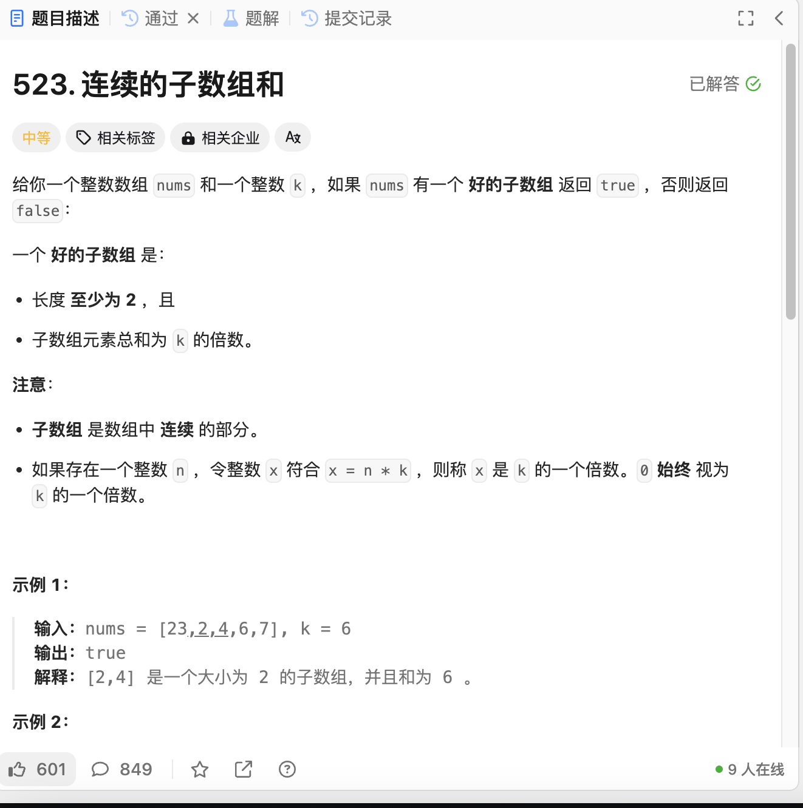

# 523. 连续的子数组和
## 题目链接  
[523. 连续的子数组和](https://leetcode.cn/problems/continuous-subarray-sum/)
## 题目详情


***
## 解答一
答题者：EchoBai

### 题解
先计算出前缀后，然后根据同余定理：如果两个整数m、n满足n-m能被k整除，那么n和m对k同余即 ( pre(j) - pre (i) ) % k == 0 则 pre(j) % k == pre(i) % k。利用哈希表统计看是否存在即可。

### 代码
``` cpp
class Solution {
public:
    bool checkSubarraySum(vector<int>& nums, int k) {
        int size = nums.size() + 1;
        vector<long long> prefSum(size, 0);
        long long sum = 0;
        for(int i = 1; i < size; ++i){
            sum += nums[i - 1];
            prefSum[i] = sum;
        }
        map<int ,int> mp;
        for(int i = 0; i < size; ++i){
            int key = prefSum[i] % k;
            if(mp.count(key) && i - mp[key] >= 2){
                return true;
            }
            else if(!mp.count(key)){
                mp[key] = i;
            }
        }
        return false;
    }
};
```
