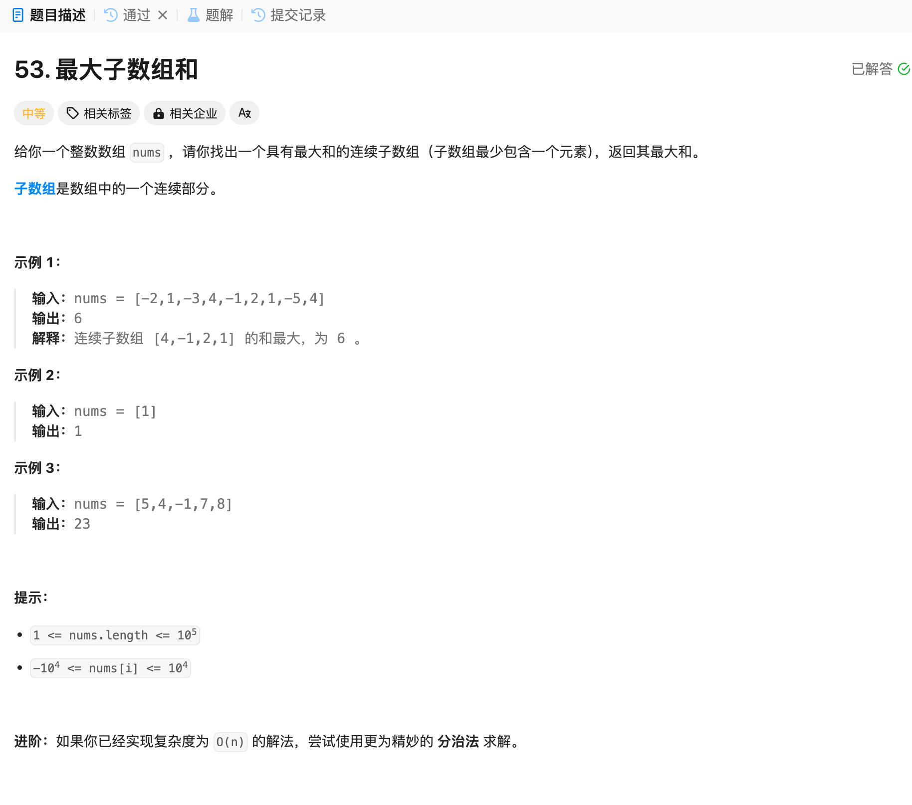

# 53. 最大子数组和
## 题目链接  
[53. 最大子数组和](https://leetcode.cn/problems/maximum-subarray/description/)
## 题目详情


***
## 解答一
答题者：EchoBai

### 题解
贪心，当当前和变为负数，往下累加就会拖累整体最大，因此直接重新开始计算就行。

### 代码
``` cpp
class Solution {
public:
    int maxSubArray(vector<int>& nums) {
        int size = nums.size();
        if(size == 1) return nums[0];
        int sum = INT32_MIN;
        int result = 0;
        for(int i = 0; i < size; ++i){
            result += nums[i];
            sum = std::max(result, sum);
            if(result < 0) result = 0; 
        }
        return sum;
    }
};
```
