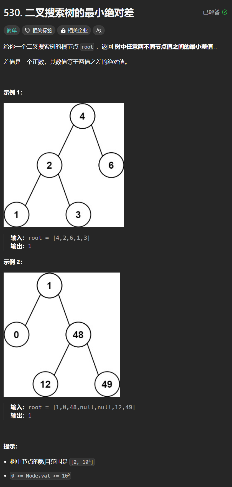

# 530. 二叉搜索树中的最小绝对值差
## 题目链接  
[530. 二叉搜索树中的最小绝对值差](https://leetcode.cn/problems/minimum-absolute-difference-in-bst/description/)
## 题目详情


***
## 解答一
答题者：**Yuiko630**

### 题解
>二叉搜索树中一定是两个挨着的节点差值最小，所以可以在迭代中序遍历时记录pre，与当前的cur比较。

### 代码
``` Java
/**
 * Definition for a binary tree node.
 * public class TreeNode {
 *     int val;
 *     TreeNode left;
 *     TreeNode right;
 *     TreeNode() {}
 *     TreeNode(int val) { this.val = val; }
 *     TreeNode(int val, TreeNode left, TreeNode right) {
 *         this.val = val;
 *         this.left = left;
 *         this.right = right;
 *     }
 * }
 */
class Solution {
    public int getMinimumDifference(TreeNode root) {
        Stack<TreeNode> stack = new Stack<TreeNode>();
        int result = Integer.MAX_VALUE;
        TreeNode cur = root;
        TreeNode pre = null;
        while(!stack.isEmpty() || cur != null){
            if(cur != null){
                stack.push(cur);
                cur = cur.left;
            }
            else{
                cur = stack.pop();
                if(pre != null){
                    result = Math.min(result, cur.val - pre.val);
                }
                pre = cur;
                cur = cur.right;
            }
        }
        return result;
    }
}
```