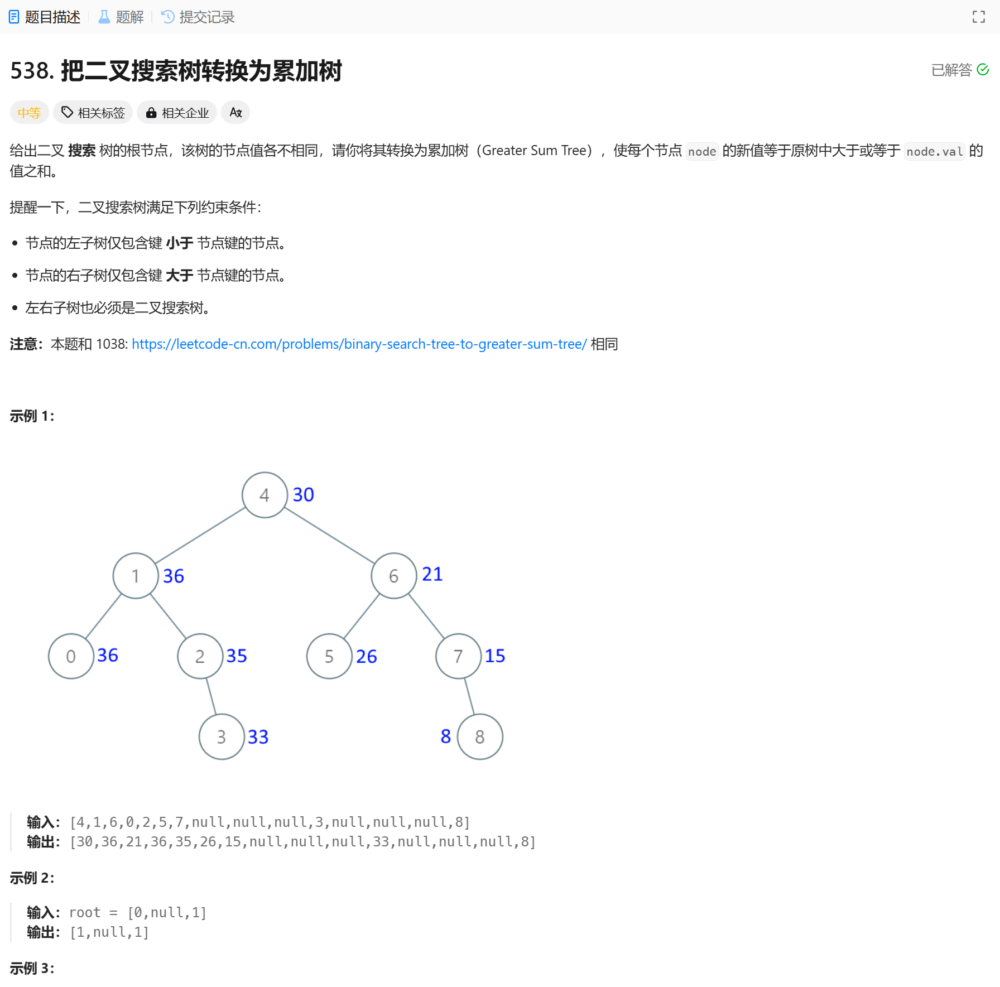

# 538. 把二叉搜索树转换为累加树
## 题目链接  
[538. 把二叉搜索树转换为累加树](https://leetcode.cn/problems/convert-bst-to-greater-tree/)
## 题目详情


## 解答一
答题者：EchoBai

### 题解
从右子树开始，令val = 0。然后每递归遇到节点就累加上当前值，返回。按照右中左的顺序遍历即可。

### 代码
``` cpp
/**
 * Definition for a binary tree node.
 * struct TreeNode {
 *     int val;
 *     TreeNode *left;
 *     TreeNode *right;
 *     TreeNode() : val(0), left(nullptr), right(nullptr) {}
 *     TreeNode(int x) : val(x), left(nullptr), right(nullptr) {}
 *     TreeNode(int x, TreeNode *left, TreeNode *right) : val(x), left(left), right(right) {}
 * };
 */
class Solution {
public:
    TreeNode* convertBST(TreeNode* root) {
        // right
        // middle
        // left
        int val = 0;
        travel(root, val);
        return root;
    }

    void travel(TreeNode* root, int& val){
        if(!root) return;
        travel(root->right, val);
        if(root){
            root->val += val;
            val = root->val;
        }
        travel(root->left, val);
    }
};
```

## 解答二
答题者：**Yuiko630**

### 题解
>迭代法，反中序遍历，从后往前累加数组，右->中->左。

### 代码
``` Java
/**
 * Definition for a binary tree node.
 * public class TreeNode {
 *     int val;
 *     TreeNode left;
 *     TreeNode right;
 *     TreeNode() {}
 *     TreeNode(int val) { this.val = val; }
 *     TreeNode(int val, TreeNode left, TreeNode right) {
 *         this.val = val;
 *         this.left = left;
 *         this.right = right;
 *     }
 * }
 */
class Solution {
    public TreeNode convertBST(TreeNode root) {
        int pre = 0;
        Stack<TreeNode> stack = new Stack<TreeNode>();
        TreeNode cur = root;
        while(cur != null || !stack.isEmpty()){
            if(cur != null){
                stack.push(cur);
                cur = cur.right;
            }
            else{
                cur = stack.pop();
                cur.val += pre;
                pre = cur.val;
                cur = cur.left;
            }
        }
        return root;
    }
}
```
