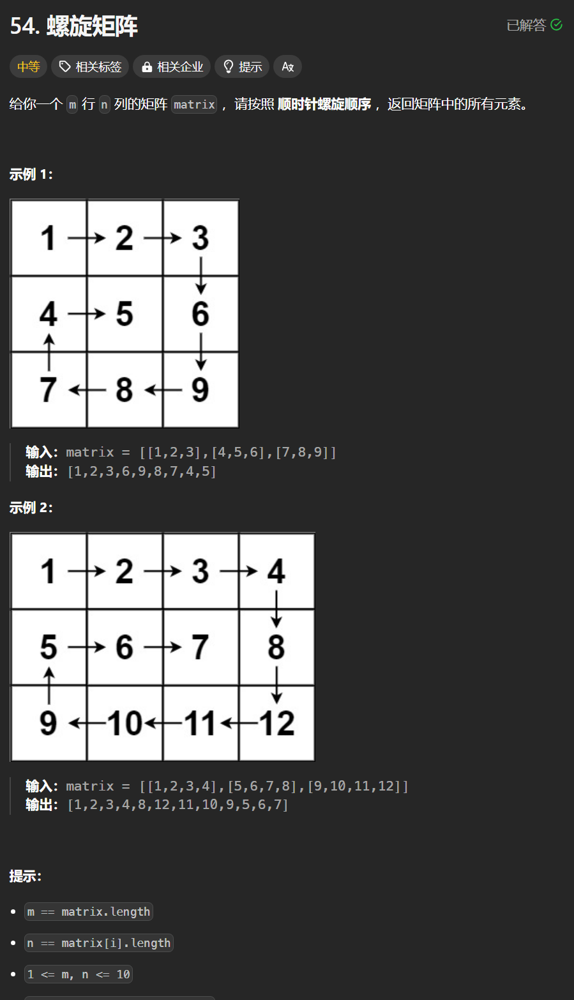

# 54. 螺旋矩阵
## 题目链接  
[54. 螺旋矩阵](https://leetcode.cn/problems/spiral-matrix/description/)
## 题目详情


***
## 解答一
答题者：**Yuiko630**

### 题解
>填充上行从左到右left->right，填充右列从上到下top+1->bottom，填充下行从右到左right-1->left-1，填充左列从下到上bottom->top-1。

### 代码
``` Java
class Solution {
    public List<Integer> spiralOrder(int[][] matrix) {
        int m = matrix.length;
        int n = matrix[0].length;
        List<Integer> result = new ArrayList<>();
        int left = 0, top = 0, right = n-1, bottom = m-1;
        while(top <= bottom && left <= right){
            for(int j = left; j <= right; j++){
                result.add(matrix[top][j]);
            }
            for(int i = top+1; i <= bottom; i++){
                result.add(matrix[i][right]);
            }
            if(top < bottom && left < right){
                for(int j = right-1; j > left; j--){
                    result.add(matrix[bottom][j]);
                }
                for(int i = bottom; i > top; i--){
                    result.add(matrix[i][left]);
                }
            }
            top++;
            left++;
            bottom--;
            right--;
        }
        return result;
    }
}
```