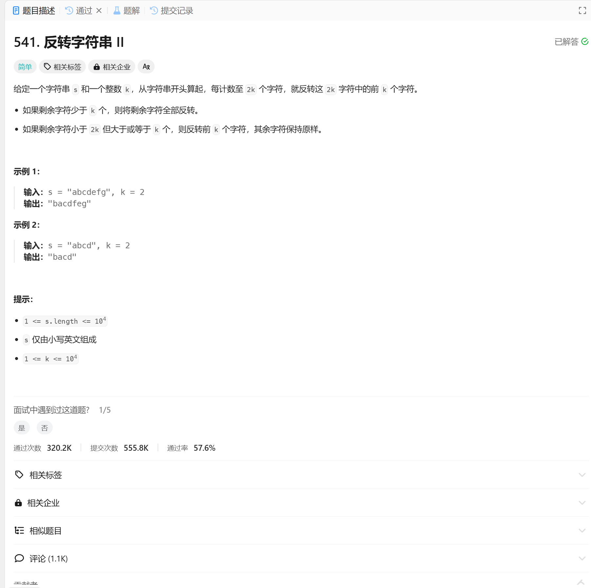

# 541. 反转字符串 II
## 题目链接  
[541. 反转字符串 II](https://leetcode.cn/problems/reverse-string-ii/description/)
## 题目详情


***
## 解答一
答题者：EchoBai

### 题解
用栈存储 <= k 的部分。中间变量缓存 >k && < 2k的，最后出栈重组即可。

### 代码
``` cpp
class Solution {
public:
    string reverseStr(string s, int k) {
        // pay attention to we can't use system function reverse()
        std::stack<char> sk;
        int cnt = 1;
        std::string res;
        std::string mids;
        for(auto c : s){
            if(cnt <= k){
                sk.push(c);
            }else if(cnt > k && cnt < 2 *k){
                mids += c;
            }else if(cnt == 2 * k){
                while(!sk.empty()){
                    res += sk.top();
                    sk.pop();
                }
                res += mids;
                res += c;
                mids.clear();
                cnt = 0;
            }
            ++cnt;
        }
        while(!sk.empty()){
            res += sk.top();
            sk.pop();
        }
        if(mids.length() > 0) res += mids;
        return res;
    }
};
```

```c++
class Solution {
public:
    string reverseWords(string s) {
        std::vector<string> vt;
        stringstream ss(s);
        string word;
        std::string res;
        while (ss >> word) {
            vt.emplace_back(word);
        }
        for(int i = vt.size() - 1; i >=1; --i){
            res += vt[i];
            res += " ";
        }
        res += vt[0];
        return res;
    }
};
```
