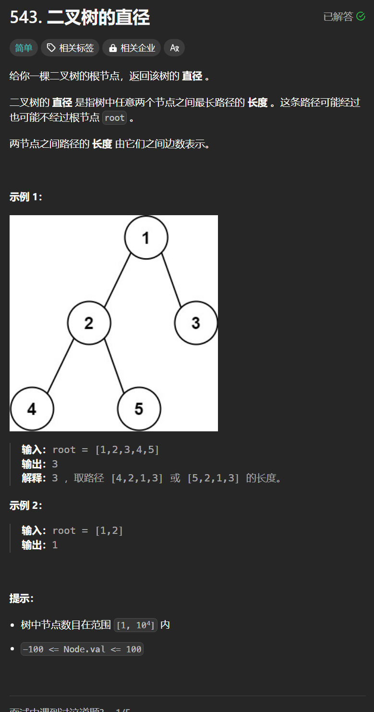

# 543. 二叉树的直径
## 题目链接  
[543. 二叉树的直径](https://leetcode.cn/problems/diameter-of-binary-tree/description/)
## 题目详情


***
## 解答一
答题者：**Yuiko630**

### 题解
>两个节点间的最大直径可以表示为以中间节点向下的最大左子树深度+最大右子树深度，故可以转换成递归求左右子树高度后比较是否为最大直径。

### 代码
``` Java
/**
 * Definition for a binary tree node.
 * public class TreeNode {
 *     int val;
 *     TreeNode left;
 *     TreeNode right;
 *     TreeNode() {}
 *     TreeNode(int val) { this.val = val; }
 *     TreeNode(int val, TreeNode left, TreeNode right) {
 *         this.val = val;
 *         this.left = left;
 *         this.right = right;
 *     }
 * }
 */
class Solution {
    int res = 0;
    public int diameterOfBinaryTree(TreeNode root) {
        if(root.left == null && root.right == null) return 0;
        len(root);
        return res;
    }
    public int len(TreeNode node){
        if(node == null){
            return 0;
        }
        int left = len(node.left);
        int right = len(node.right);
        res = Math.max(res, left+right);
        return Math.max(left, right) + 1;
    }
}
```