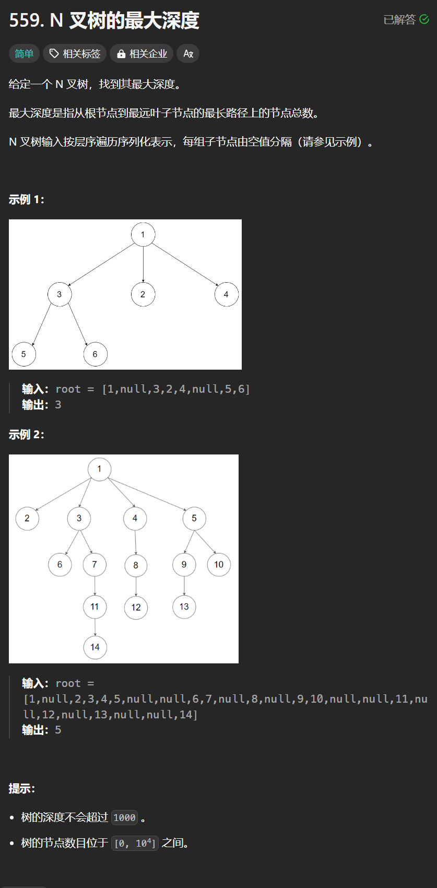

# 559. N叉树的最大深度
## 题目链接  
[559. N叉树的最大深度](https://leetcode.cn/problems/maximum-depth-of-n-ary-tree/description/)
## 题目详情


***
## 解答一
答题者：**Yuiko630**

### 题解
>层序遍历的基础上加个depth就行。

### 代码
``` Java
/*
// Definition for a Node.
class Node {
    public int val;
    public List<Node> children;

    public Node() {}

    public Node(int _val) {
        val = _val;
    }

    public Node(int _val, List<Node> _children) {
        val = _val;
        children = _children;
    }
};
*/

class Solution {
    public int maxDepth(Node root) {
        if(root == null) return 0;
        Queue<Node> queue = new LinkedList<Node>();
        queue.offer(root);
        int depth = 0;
        while(!queue.isEmpty()){
            int count = queue.size();
            depth ++;
            for(int i = 0; i < count; i++){
                Node node = queue.poll();
                for(Node child : node.children){
                    queue.offer(child);
                }
            }
        }
        return depth;
    }
}
```