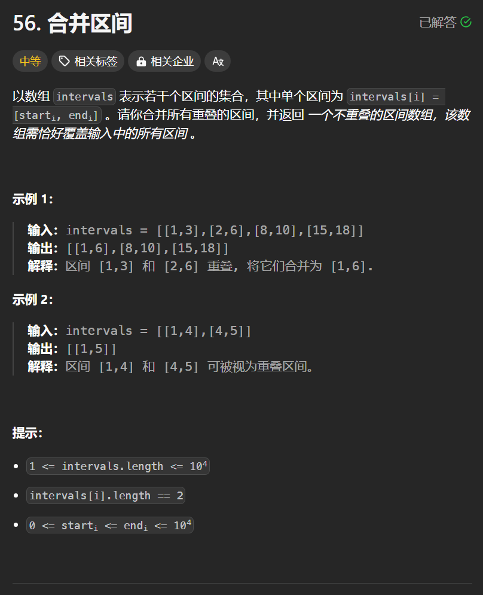

# 56. 合并区间
## 题目链接  
[56. 合并区间](https://leetcode.cn/problems/merge-intervals/description/)
## 题目详情


***
## 解答一
答题者：**Yuiko630**

### 题解
>贪心算法，先按照左边界排序，初始化区间start和end，然后遍历一遍当前区间是否与end重合，不重合则添加区间并更新start和end，重合则更新end为最大右边界。

### 代码
``` Java
class Solution {
    public int[][] merge(int[][] intervals) {
        // 使用Integer内置比较方法，不会溢出
        Arrays.sort(intervals, (a,b) -> Integer.compare(a[0], b[0]));
        ArrayList<int[]> result = new ArrayList<>();
        int start = intervals[0][0];
        int end = intervals[0][1];
        for(int i = 1; i < intervals.length; i++){
            if(intervals[i][0] > end){
                result.add(new int[]{start, end});
                start = intervals[i][0];
                end = intervals[i][1];
            }
            else{
                end = Math.max(intervals[i][1], end);
            }
        }
        result.add(new int[]{start, end});
        return result.toArray(new int[result.size()][]);
    }
}
```