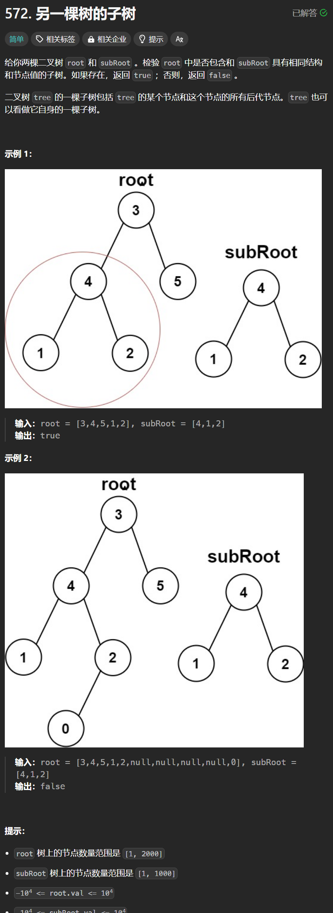

# 572. 另一棵树的子树
## 题目链接  
[572. 另一棵树的子树](https://leetcode.cn/problems/subtree-of-another-tree/description/)
## 题目详情


***
## 解答一
答题者：**Yuiko630**

### 题解
>结合一下第100题，判断是否相同的树，层序遍历一遍root看是否有节点满足与subRoot相同。

### 代码
``` Java
/**
 * Definition for a binary tree node.
 * public class TreeNode {
 *     int val;
 *     TreeNode left;
 *     TreeNode right;
 *     TreeNode() {}
 *     TreeNode(int val) { this.val = val; }
 *     TreeNode(int val, TreeNode left, TreeNode right) {
 *         this.val = val;
 *         this.left = left;
 *         this.right = right;
 *     }
 * }
 */
class Solution {
    public boolean isSameTree(TreeNode p, TreeNode q) {
        Queue<TreeNode> queue1 = new LinkedList<TreeNode>();
        Queue<TreeNode> queue2 = new LinkedList<TreeNode>();
        queue1.offer(p);
        queue2.offer(q);
        while(!queue1.isEmpty() && !queue2.isEmpty()){
            TreeNode node1 = queue2.poll();
            TreeNode node2 = queue1.poll();
            if(node1 == null & node2 == null) continue;
            else if(node1 == null || node2 == null) return false;
            else if(node1.val != node2.val) return false;

            queue1.offer(node1.left);
            queue2.offer(node2.left);
            queue1.offer(node1.right);
            queue2.offer(node2.right);
        }
        return queue1.isEmpty() && queue2.isEmpty();
    }
    public boolean isSubtree(TreeNode root, TreeNode subRoot) {
        Queue<TreeNode> queue = new LinkedList<TreeNode>();
        queue.offer(root);
        while(!queue.isEmpty()){
            TreeNode node = queue.poll();
            if(isSameTree(node, subRoot)) return true;
            if(node.left != null) queue.offer(node.left);
            if(node.right != null) queue.offer(node.right);
        }
        return false;
    }
}
```