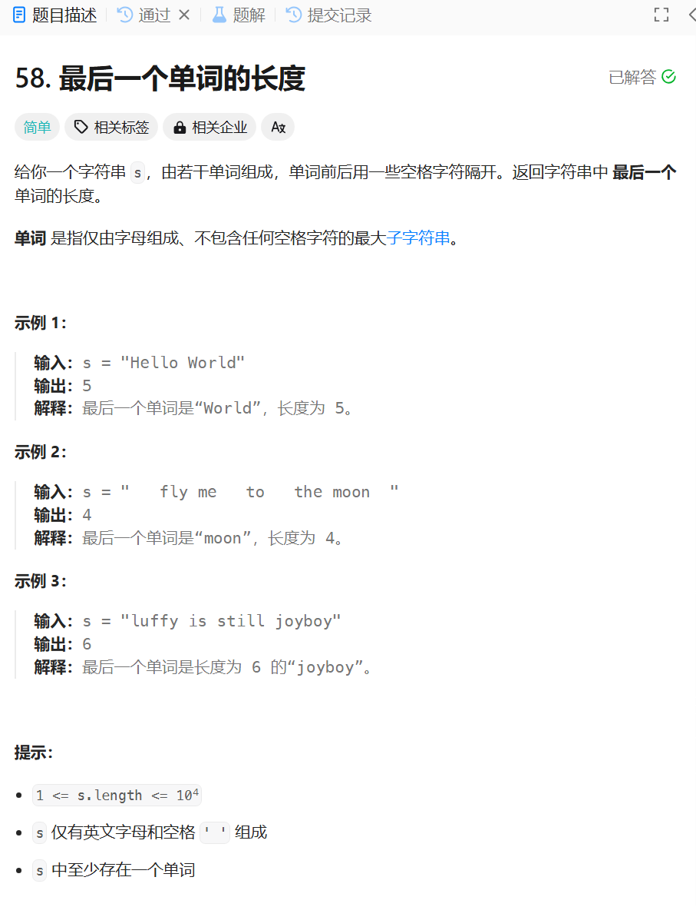

# 58. 最后一个单词的长度
## 题目链接  
[58. 最后一个单词的长度](https://leetcode.cn/problems/length-of-last-word/description/)
## 题目详情


***
## 解答一
答题者：**Yuiko630**

### 题解
>用双指针遍历一遍，慢的指向开头第一个字母，快的指向结尾，用flag表示当前可以是单词的第一个字母。最后返回right-left+1长度。

### 代码
``` Java
class Solution {
    public int lengthOfLastWord(String s) {
        int left = 0;
        int right = 0;
        int flag = 1;
        for (int i = 0; i < s.length(); i++) {
            if (s.charAt(i) != ' ') {
                if (flag == 1) {
                    left = i;
                    flag = 0;
                }
                right = i;
            } else {
                flag = 1;
            }
        }
        return right - left + 1;
    }
}
```

## 解答二
答题者：**Yuiko630**

### 题解
>双指针反向遍历，right去找第一个不为空格的字符，left去找right前第一个空格。最后返回right-left长度。

### 代码
``` Java
class Solution {
    public int lengthOfLastWord(String s) {
        int length = s.length();
        int left = length - 1;
        int right = length - 1;
        while (left >= 0) {
            if (s.charAt(right) == ' ') {
                right--;
                left--;
            } 
            else if (s.charAt(left) == ' ') {
                break;
            } 
            else {
                left--;
            }
        }
        return right - left;
    }
}
```
