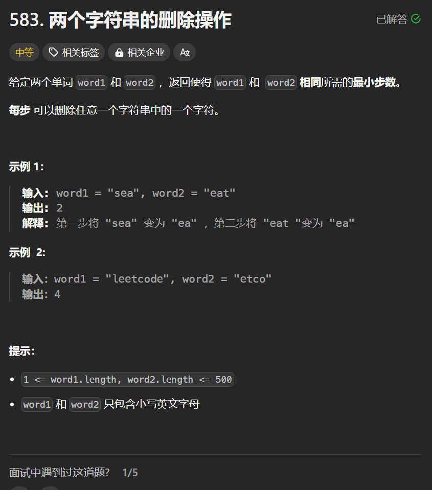

# 583. 两个字符串的删除操作
## 题目链接  
[583. 两个字符串的删除操作](https://leetcode.cn/problems/delete-operation-for-two-strings/description/)
## 题目详情


***
## 解答一
答题者：**Yuiko630**

### 题解
>定义:dp[i][j]表示包括i-1的s和包括j-1的t达相等时最少删除次数
>2. 转移方程:
>>if(s[i-1] == t[j-1]) dp[i][j] = dp[i-1][j-1]; // 相同时不用删
>>dp[i][j] = dp[i-1][j] + 1 // 删s[i-1] 
>>dp[i][j] = dp[i][j-1] + 1 // 删t[j-1] 
>>dp[i][j] = dp[i-1][j-1] + 2 // 同时删
>3. 初始化:dp[i][0]=i表示位置i匹配空串需删i次，dp[0][j]=j表示位置j匹配空串需删j次
>4. 遍历:外层循环i从1-s.length，内层循环j从1-t.length
>5. 推导

### 代码
``` Java
class Solution {
    public int minDistance(String word1, String word2) {
        int[][] dp = new int[word1.length()+1][word2.length()+1];
        for(int i = 0; i <= word1.length(); i ++){
            dp[i][0] = i;
        }
        for(int j = 0; j <= word2.length(); j++){
            dp[0][j] = j;
        }
        for(int i = 1; i <= word1.length(); i++){
            for(int j = 1; j <= word2.length(); j++){
                if(word1.charAt(i-1) == word2.charAt(j-1)){
                    dp[i][j] = dp[i-1][j-1];
                }
                else{
                    dp[i][j] = Math.min(Math.min(dp[i-1][j]+1, dp[i][j-1]+1),dp[i-1][j-1] + 2);
                }
            }
        }
        return dp[word1.length()][word2.length()];
    }
}
```