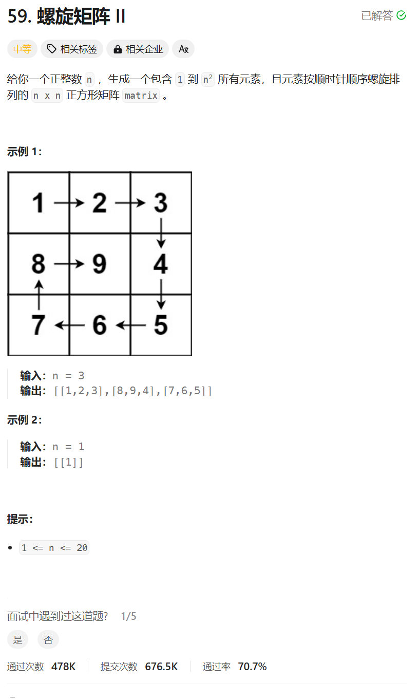

# 59. 螺旋矩阵II
## 题目链接  
[59. 螺旋矩阵II](https://leetcode.cn/problems/spiral-matrix-ii/description/)
## 题目详情


***
## 解答一
答题者：**Yuiko630**

### 题解
>填充上行从左到右，填充右列从上到下，填充下行从右到左，填充左列从下到上，单独判断中间值。循环不变量，每次填充n-offset个，保证左闭右开。

### 代码
``` Java
class Solution {
    public int[][] generateMatrix(int n) {
        int[][] matrix = new int[n][n];
        int loop = 1; // 循环的圈数，不超过n/2
        int count = 1; // 填的数字
        int offset = 1; // 每圈填充的偏移量
        int startX = 0;
        int startY = 0;
        int i, j;
        while(loop <= n /2){
            for(j = startY; j < n - offset; j++){
                matrix[startX][j] = count++;
            }
            for(i = startX; i < n - offset; i++){
                matrix[i][j] = count++;
            }
            for(; j >= offset; j--){
                matrix[i][j] = count++;
            }
            for(; i >= offset; i--){
                matrix[i][j] = count++;
            }
            startX++;
            startY++;
            offset++;
            loop++;
        }
        if( n%2 == 1){ // 如果是奇数填充矩阵中间值
            matrix[n/2][n/2] = count;
        }
        return matrix;
    }
}
```