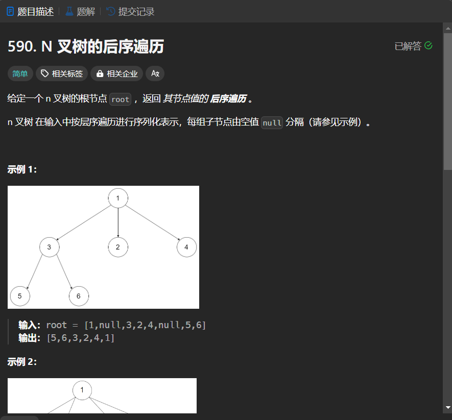

# 590. N 叉树的后序遍历
## 题目链接  
[590. N 叉树的后序遍历](https://leetcode.cn/problems/n-ary-tree-postorder-traversal/description/)
## 题目详情


***
## 解答一
答题者：EchoBai

### 题解
递归即可。

### 代码
``` cpp
/*
// Definition for a Node.
class Node {
public:
    int val;
    vector<Node*> children;

    Node() {}

    Node(int _val) {
        val = _val;
    }

    Node(int _val, vector<Node*> _children) {
        val = _val;
        children = _children;
    }
};
*/

class Solution {
public:
    vector<int> postorder(Node* root) {
        vector<int> res;
        order(root,res);
        return res;
    }
    void order(Node* root, vector<int> &res){
        if(!root) return;
        for(auto r : root->children)
            order(r,res);
        res.push_back(root->val);
    }
};
```


