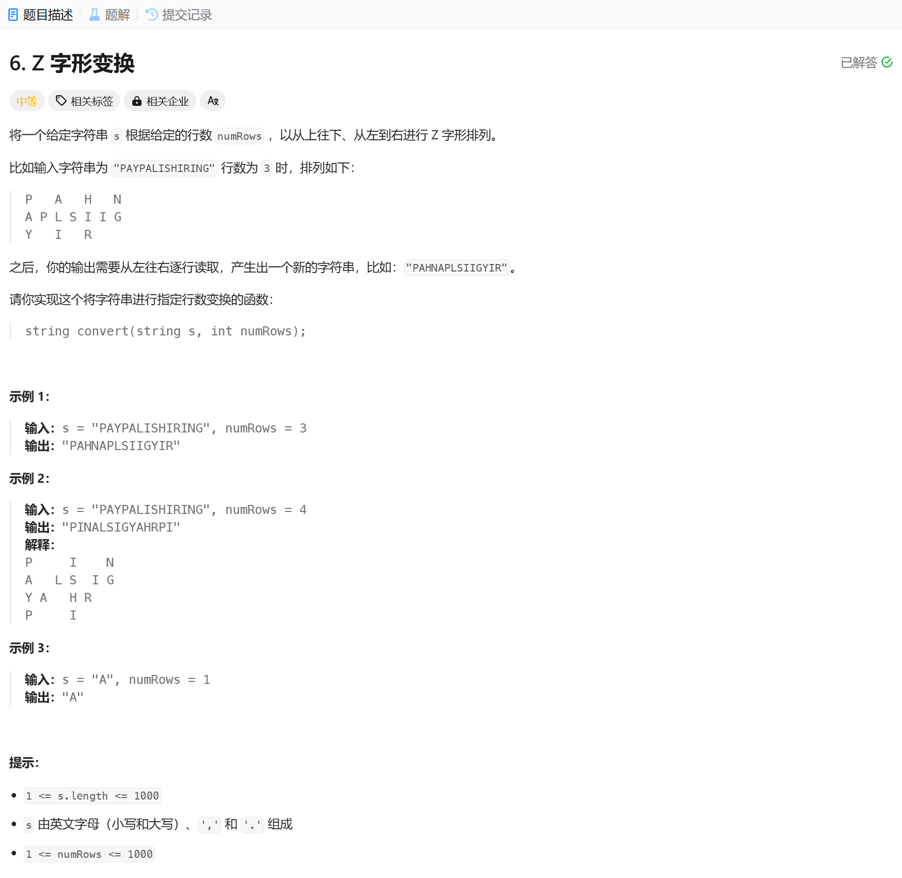

# 6. Z 字形变换
## 题目链接  
[6. Z 字形变换](https://leetcode.cn/problems/zigzag-conversion/description/)
## 题目详情


***
## 解答一
答题者：**EchoBai**

## 题解
>按照题目进行模拟，用一个方向控制其在将字符放入到不同的字符串数组中。然后从上到下依次将字符串组合即可。

### 代码
``` c++
class Solution {
public:
    string convert(string s, int numRows) {
        if(numRows == 1) return s;
        string res;
        int direction = -1;
        vector<string> str(numRows);
        int i = 0;
        for(const auto& c : s){
            str[i].push_back(c);
            if(i == 0 || i == numRows - 1){
                direction = -direction;
            }
            i += direction;
        }

        for(const auto& e : str){
            res += e;
        }

        return res;
    }
};
```
