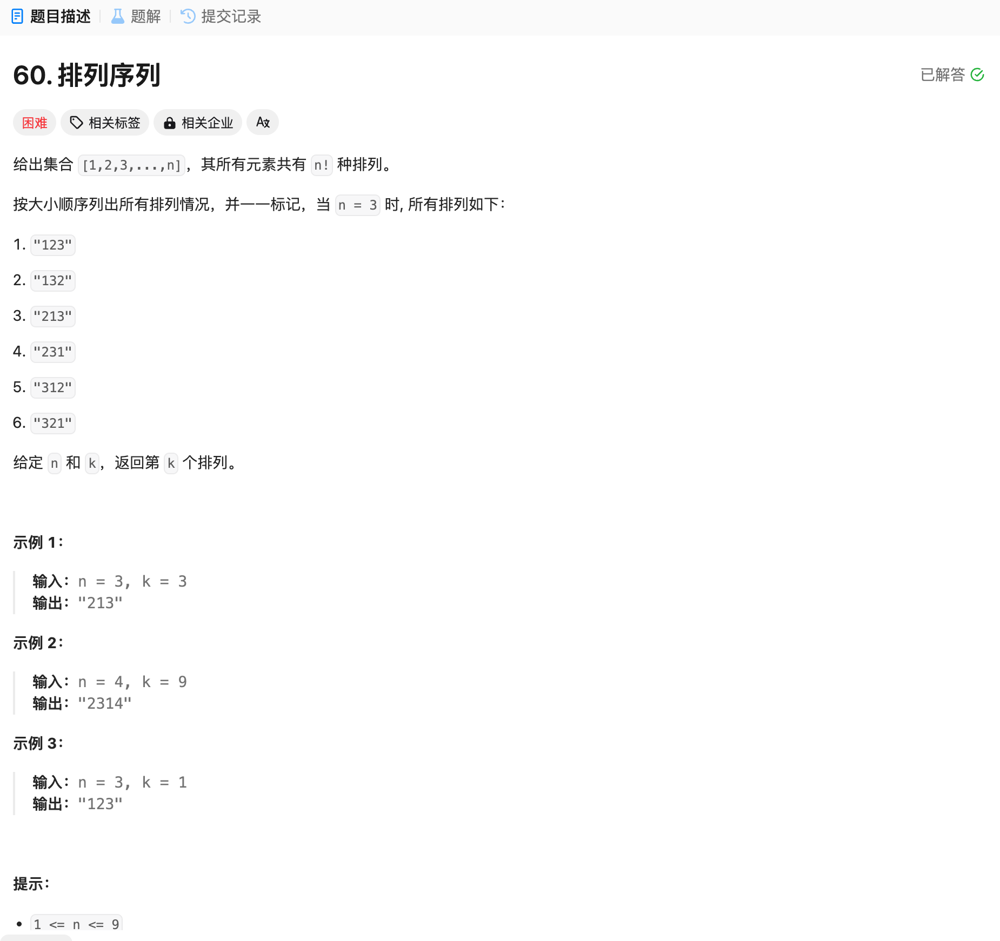

# 60. 排列序列
## 题目链接  
[60. 排列序列](https://leetcode.cn/problems/permutation-sequence/description/)
## 题目详情


***
## 解答一
答题者：EchoBai

### 题解
回溯法，直接从数字1开始，这样选择处来的序列自然是按从小到大的顺序排列的，由于是全排列所以用used数组避免选择到重复的。同时使用一个计数器当计数到k的时候直接返回结果即可。

### 代码
``` cpp
class Solution {
    string path;
public:
    string getPermutation(int n, int k) {
        int cnt = 0;
        string res;
        vector<bool> used(n, false);
        backtracking(n, k, cnt, res, used);
        return res;
    }

    void backtracking(int n, int k, int& cnt, string& res, vector<bool>& used){
        bool ok = false;
        if(path.size() == n){
            ++cnt;
            if(cnt == k){
                ok = true;
                res = path;
            }
            return;
        }

        for(char c = '1'; c <= (n + '0'); ++c){
            if(ok) return;
            if(used[c - '0']) continue;
            used[c - '0'] = true;
            path.push_back(c);
            backtracking(n, k, cnt, res, used);
            used[c - '0'] = false;
            path.pop_back();
        }
    }
};
```
