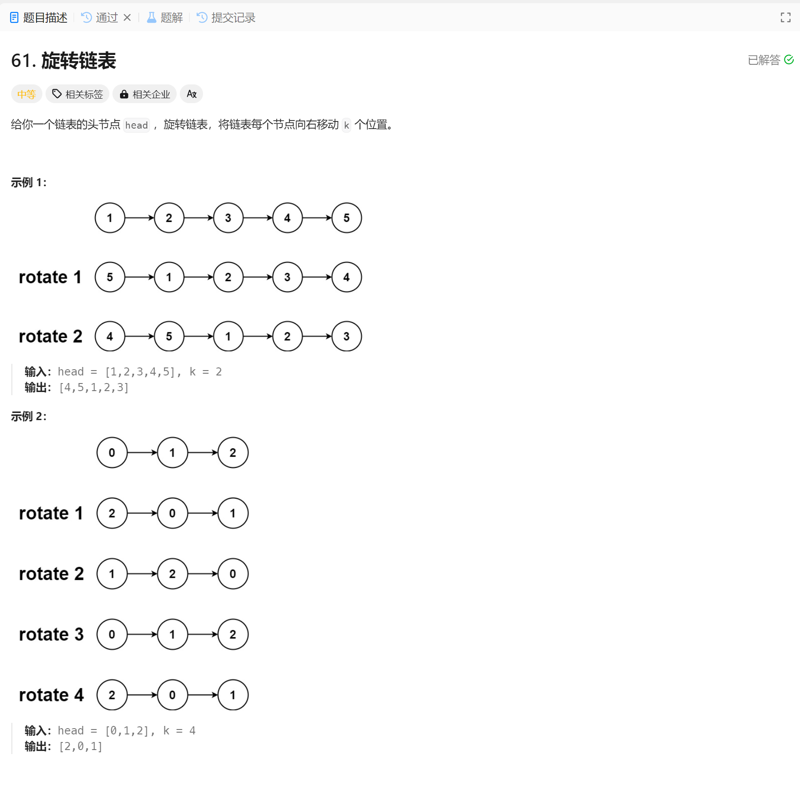

# 61. 旋转链表
## 题目链接  
[61. 旋转链表](https://leetcode.cn/problems/rotate-list/description/)
## 题目详情


***
## 解答一
答题者：EchoBai

### 题解
直接操作链表比较繁琐，可以把元素转到一个数组中，然后把数组当作循环数组，重新计算每个元素的位置，最后重组链表即可

### 代码
``` cpp
/**
 * Definition for singly-linked list.
 * struct ListNode {
 *     int val;
 *     ListNode *next;
 *     ListNode() : val(0), next(nullptr) {}
 *     ListNode(int x) : val(x), next(nullptr) {}
 *     ListNode(int x, ListNode *next) : val(x), next(next) {}
 * };
 */
class Solution {
public:
    ListNode* rotateRight(ListNode* head, int k) {

        if(!head || !head->next || k == 0) return head;

        ListNode* ret = new ListNode(-1);
        ListNode* p = head;
        head = ret;
        std::vector<int> _vt;

        while(p){
            _vt.emplace_back(p->val);
            p = p->next;
        }

        int size = _vt.size();

        // take the link as a recylce  array and compute specific location
        // loc = (loc' + k) % size 

        std::vector<int> _vts(size, -1);
        for(int i = 0; i < size; ++i){
            int loc = (i + k) % size;
            _vts[loc] = _vt[i];
        }

        // rebuild link
        for(auto e : _vts){
            ListNode* t = new ListNode(e);
            ret->next = t;
            ret = ret->next;
        }
        return head->next;
    }
};
```
