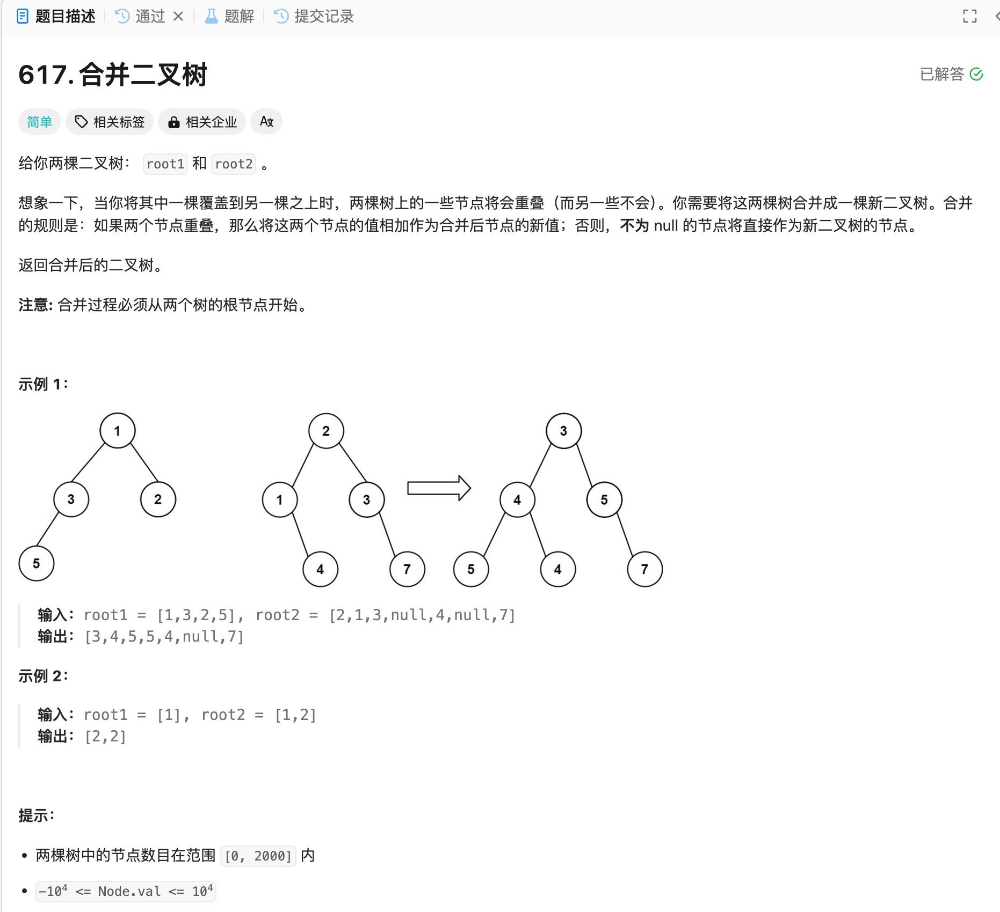

# 617. 合并二叉树
## 题目链接  
[617. 合并二叉树](https://leetcode.cn/problems/merge-two-binary-trees/description/)
## 题目详情


***
## 解答一
答题者：EchoBai

### 题解
按照题意，递归建立即可。

### 代码
``` cpp
/**
 * Definition for a binary tree node.
 * struct TreeNode {
 *     int val;
 *     TreeNode *left;
 *     TreeNode *right;
 *     TreeNode() : val(0), left(nullptr), right(nullptr) {}
 *     TreeNode(int x) : val(x), left(nullptr), right(nullptr) {}
 *     TreeNode(int x, TreeNode *left, TreeNode *right) : val(x), left(left), right(right) {}
 * };
 */
class Solution {
public:
    TreeNode* mergeTrees(TreeNode* root1, TreeNode* root2) {
        if(!root1 ) return root2;
        if(!root2) return root1;
        TreeNode* root = new TreeNode(root1->val + root2->val);
        root->left = mergeTrees(root1->left, root2->left);
        root->right = mergeTrees(root1->right, root2->right);
        return root;
    }
};
```

## 解答二
答题者：**Yuiko630**

### 题解
>两棵树一起层序遍历，以root1为基准，没有则复制，有则加值。

### 代码
``` Java
/**
 * Definition for a binary tree node.
 * public class TreeNode {
 *     int val;
 *     TreeNode left;
 *     TreeNode right;
 *     TreeNode() {}
 *     TreeNode(int val) { this.val = val; }
 *     TreeNode(int val, TreeNode left, TreeNode right) {
 *         this.val = val;
 *         this.left = left;
 *         this.right = right;
 *     }
 * }
 */
class Solution {
    public TreeNode mergeTrees(TreeNode root1, TreeNode root2) {
        if(root1 == null) return root2;
        else if(root2 == null) return root1;
        Queue<TreeNode> queue = new LinkedList<TreeNode>();
        queue.offer(root1);
        queue.offer(root2);
        while(!queue.isEmpty()){
            TreeNode node1 = queue.poll();
            TreeNode node2 = queue.poll();
            node1.val += node2.val;
            if(node1.left != null && node2.left != null){
                queue.offer(node1.left);
                queue.offer(node2.left);
            }
            if(node1.right != null && node2.right != null){
                queue.offer(node1.right);
                queue.offer(node2.right);
            }
            if(node1.left == null && node2.left != null){
                node1.left = node2.left;
            }
            if(node1.right == null && node2.right != null){
                node1.right = node2.right;
            }
        }
        return root1;
    }
}
```
