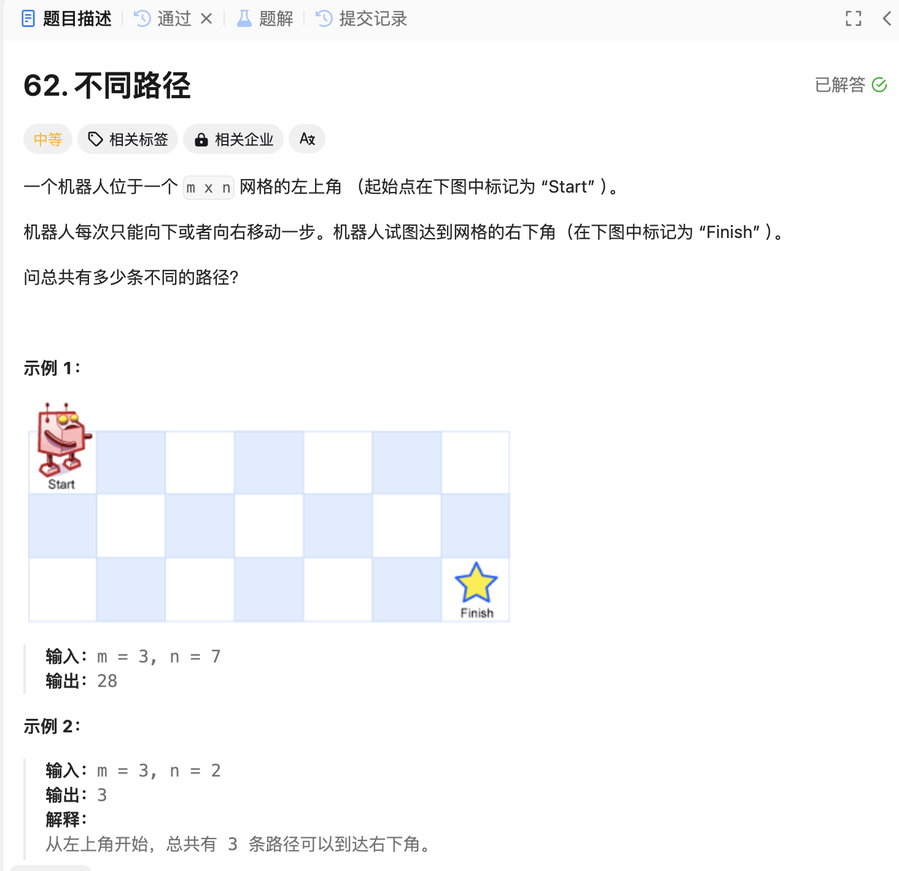

# 62. 不同路径
## 题目链接  
[62. 不同路径](https://leetcode.cn/problems/unique-paths/description/)
## 题目详情


***
## 解答一
答题者：EchoBai

### 题解
首先向下或者向右都只有一条路径，因此直接初始化，其他的就是向下和向右的路径方法之和，直接二维初始化即可。

### 代码
``` cpp
class Solution {
public:
    int uniquePaths(int m, int n) {
        long long int dp[m+1][n+1];
        for(int i = 0; i <= m; ++i){
            for(int j = 0; j <= n; ++j){
                if(i == 0 || j == 0) dp[i][j] = 1;
                else dp[i][j] = 0;
            }
        }

        for(int i = 1; i <= m; ++i){
            for(int j = 1; j <= n; ++j){
                dp[i][j] = dp[i-1][j] + dp[i][j-1];
            }
        }
        return dp[m-1][n-1];  
    }
};
```


