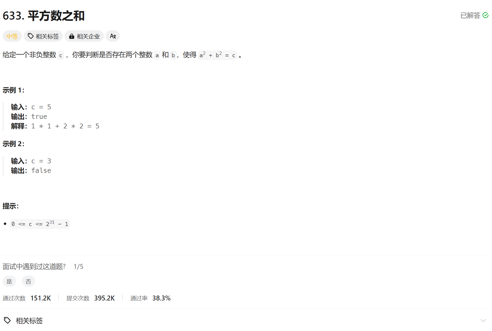

# 633. 平方数之和
## 题目链接  
[633. 平方数之和](https://leetcode.cn/problems/sum-of-square-numbers/description/?envType=daily-question&envId=2024-11-04)
## 题目详情


***
## 解答一
答题者：EchoBai

### 题解
双指针遍历即可

### 代码
``` cpp
class Solution {
public:
    bool judgeSquareSum(int c) {
        long left = 0;
        long right = std::sqrt(c);
        while(left <= right){
            long res = left * left + right * right;
            if( res == c) return true;
            else if (res < c){
                ++left;
            }else{
                --right;
            }
        }
        return false;
    }
};
```
