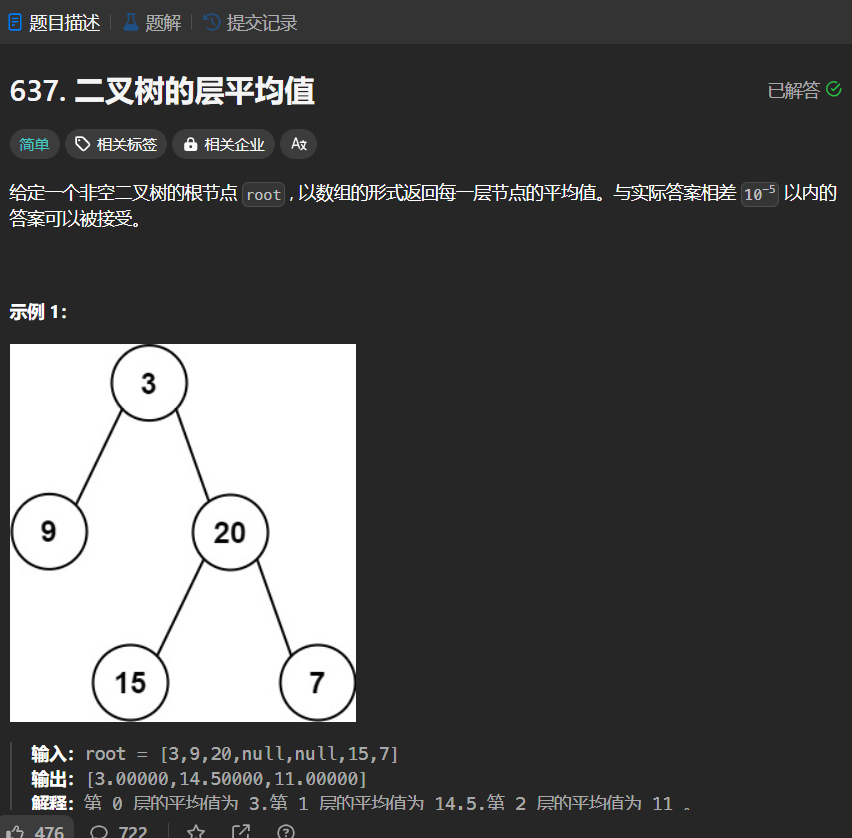

# 637. 二叉树的层平均值
## 题目链接  
[637. 二叉树的层平均值](https://leetcode.cn/problems/average-of-levels-in-binary-tree/description/?envType=study-plan-v2&envId=top-interview-150)
## 题目详情


***
## 解答一
答题者：EchoBai

### 题解
层序遍历加上处理代码。

### 代码
``` cpp
/**
 * Definition for a binary tree node.
 * struct TreeNode {
 *     int val;
 *     TreeNode *left;
 *     TreeNode *right;
 *     TreeNode() : val(0), left(nullptr), right(nullptr) {}
 *     TreeNode(int x) : val(x), left(nullptr), right(nullptr) {}
 *     TreeNode(int x, TreeNode *left, TreeNode *right) : val(x), left(left), right(right) {}
 * };
 */
class Solution {
public:
    vector<double> averageOfLevels(TreeNode* root) {
        vector<double> res;
        if(!root) return res;
        queue<TreeNode*> q;
        q.push(root);
        while(!q.empty()){
            double ave = 0.0;
            double sum = 0;
            int num = q.size();
            for(int i = num; i > 0; --i){
                TreeNode* e = q.front();
                q.pop();
                sum += e->val;
                if(e->left)
                    q.push(e->left);
                if(e->right)
                    q.push(e->right);
            }
            ave = sum / num;
            res.push_back(ave);
        }
        return res;
    }
};
```


