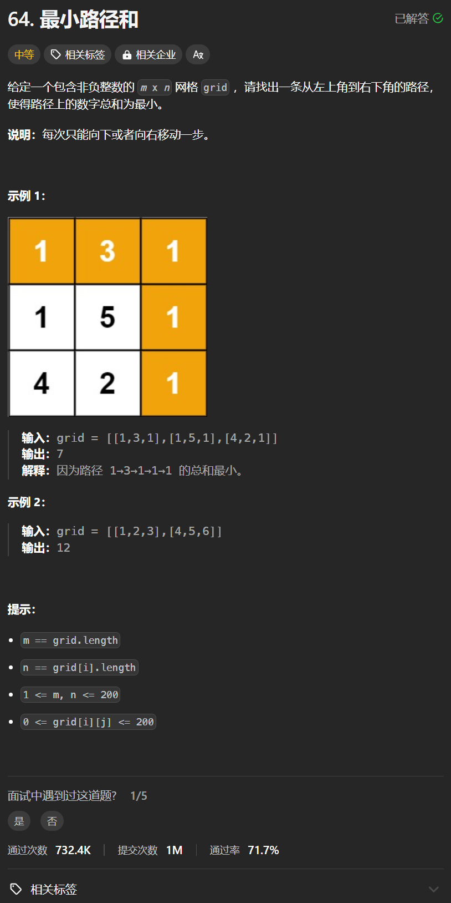

# 64. 最小路径和
## 题目链接  
[64. 最小路径和](https://leetcode.cn/problems/minimum-path-sum/description/)
## 题目详情


***
## 解答一
答题者：**Yuiko630**

### 题解
>dp五部曲
1. 定义：dp[i][j]表示从[0][0]到达[i][j]的最小路径和
2. 初始化：第一行和第一列
3. 递推公式：dp[i][j] = min(dp[i-1][j], dp[i][j-1]) + grid[i][j]
4. 遍历范围：i从1-n;j从1-m
5. 验证返回值正确

### 代码
``` Java
class Solution {
    public int minPathSum(int[][] grid) {
        int n = grid.length;
        int m = grid[0].length;
        int[][] dp = new int[n][m];
        dp[0][0] = grid[0][0];
        for(int i = 1; i < n; i++){
            dp[i][0] = dp[i-1][0] + grid[i][0];
        }
        for(int j = 1; j < m; j++){
            dp[0][j] = dp[0][j-1] + grid[0][j];
        }
        for(int i = 1; i < n; i++){
            for(int j = 1; j < m; j++){
                dp[i][j] = Math.min(dp[i-1][j] + grid[i][j], dp[i][j-1] + grid[i][j]);
            }
        }
        return dp[n-1][m-1];
    }
}
```