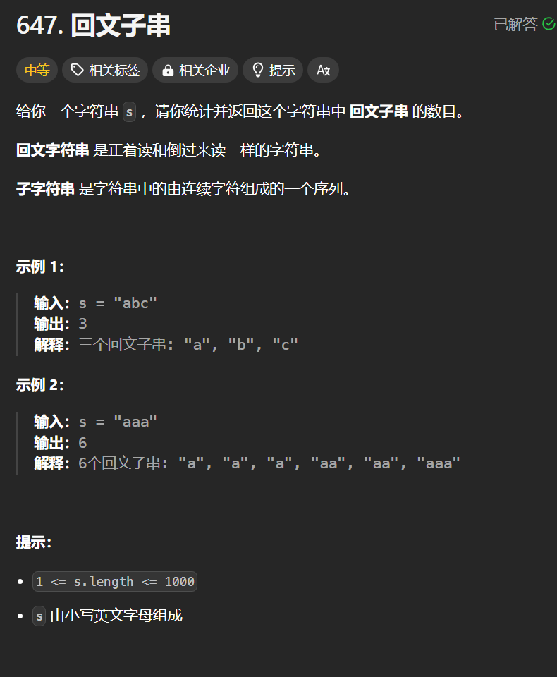

# 647. 回文子串
## 题目链接  
[647. 回文子串](https://leetcode.cn/problems/palindromic-substrings/description/)
## 题目详情


***
## 解答一
答题者：**Yuiko630**

### 题解
>定义:dp[i][j]表示子串[i,j]内是否为回文子串
>2. 转移方程:
>>if(s[i] != s[j]) dp[i][j] = false; // 不相同
>>else
>>dp[i][j] = true // i==j 下标相等只有一个字符一定是回文串
>>dp[i][j] = dp[i][j-1] + 1 // 下标差1，两个字符相等一定是回文串 
>>dp[i][j] = dp[i+1][j-1] // 下标差大于1，看dp[i+1][j-1]
>3. 初始化:全为false
>4. 遍历:外层循环i从s.length-1到0，内层循环j从i-s.length-1
>5. 推导

### 代码
``` Java
class Solution {
    public int countSubstrings(String s) {
        int result = 0;
        boolean[][] dp = new boolean[s.length()][s.length()];
        for(int i = s.length() - 1; i>= 0; i--){
            for(int j = i; j < s.length(); j++){
                if(s.charAt(i) == s.charAt(j)) {
                    if(j - i <= 1){
                        dp[i][j] = true;
                        result ++;
                    }
                    else{
                        if(dp[i+1][j-1]){
                            result++;
                            dp[i][j] = true;
                        }
                    }
                }

            }
        }
        return result;
    }
}
```