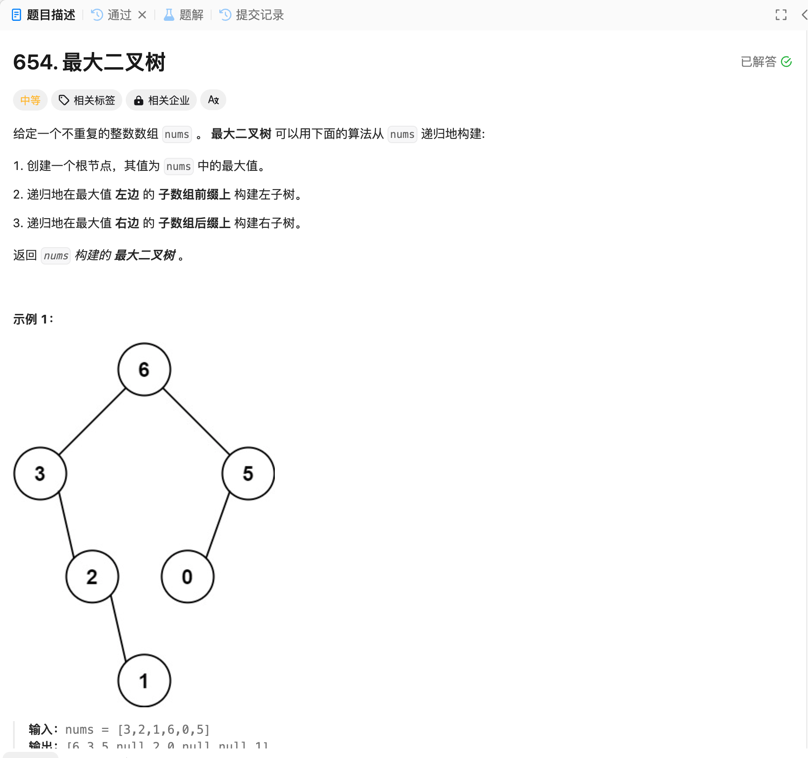

# 654. 最大二叉树
## 题目链接  
[654. 最大二叉树](https://leetcode.cn/problems/maximum-binary-tree/)
## 题目详情


***
## 解答一
答题者：EchoBai

### 题解
按照题意，求出数组最大的，然后分成左右分别递归的建立即可。

### 代码
``` cpp
/**
 * Definition for a binary tree node.
 * struct TreeNode {
 *     int val;
 *     TreeNode *left;
 *     TreeNode *right;
 *     TreeNode() : val(0), left(nullptr), right(nullptr) {}
 *     TreeNode(int x) : val(x), left(nullptr), right(nullptr) {}
 *     TreeNode(int x, TreeNode *left, TreeNode *right) : val(x), left(left), right(right) {}
 * };
 */
class Solution {
public:
    TreeNode* constructMaximumBinaryTree(vector<int>& nums) {
        if(nums.size() == 0) return nullptr;
        int max = INT_MIN;
        int idx = 0;
        for(int i = 0; i < nums.size(); ++i){
            if(nums[i] > max){
                max = nums[i];
                idx = i;
            }
        }
        TreeNode* root = new TreeNode(nums[idx]);

        vector<int> leftArray;
        for(int i = 0; i < idx; ++i){
            leftArray.push_back(nums[i]);
        }

        vector<int> rightArray;
        for(int i = idx + 1; i < nums.size(); ++i){
            rightArray.push_back(nums[i]);
        }

        root->left = constructMaximumBinaryTree(leftArray);
        root->right = constructMaximumBinaryTree(rightArray);
        return root;
    }
    
};
```


