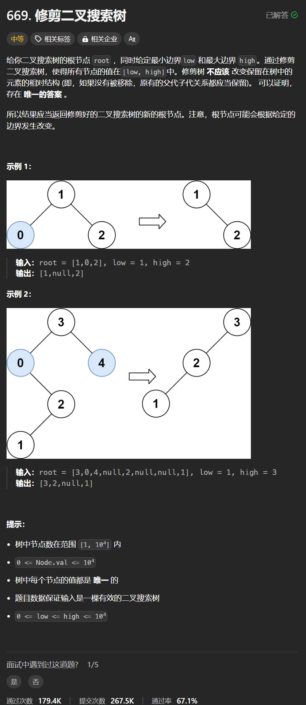

# 669. 修剪二叉搜索树
## 题目链接  
[669. 修剪二叉搜索树](https://leetcode.cn/problems/trim-a-binary-search-tree/)
## 题目详情


***
## 解答一
答题者：**Yuiko630**

### 题解
>递归，修剪使得所有节点的值位于[L,R]中，如果当前值太小，则返回递归修剪右子树，如果当前值太大，则返回递归修剪左子树。如果当前值没问题，再修剪左子树和右子树，最后返回根。

### 代码
``` Java
/**
 * Definition for a binary tree node.
 * public class TreeNode {
 *     int val;
 *     TreeNode left;
 *     TreeNode right;
 *     TreeNode() {}
 *     TreeNode(int val) { this.val = val; }
 *     TreeNode(int val, TreeNode left, TreeNode right) {
 *         this.val = val;
 *         this.left = left;
 *         this.right = right;
 *     }
 * }
 */
class Solution {
    public TreeNode trimBST(TreeNode root, int low, int high) {
        if(root == null) return null;
        if(root.val < low){
            return trimBST(root.right, low, high);
        }
        if(root.val > high){
            return trimBST(root.left, low, high);
        }
        root.left = trimBST(root.left, low, high);
        root.right = trimBST(root.right, low, high);
        return root;
    }
}
```

## 解答二
答题者：**Yuiko630**

### 题解
>迭代，先将root移动到[L,R]的范围内，再修剪左子树，这时只需要处理小于L的情况，再修剪右子树，这时只需要处理大于R的情况。

### 代码
``` Java
/**
 * Definition for a binary tree node.
 * public class TreeNode {
 *     int val;
 *     TreeNode left;
 *     TreeNode right;
 *     TreeNode() {}
 *     TreeNode(int val) { this.val = val; }
 *     TreeNode(int val, TreeNode left, TreeNode right) {
 *         this.val = val;
 *         this.left = left;
 *         this.right = right;
 *     }
 * }
 */
class Solution {
    public TreeNode trimBST(TreeNode root, int low, int high) {
        if(root == null) return null;
        while(root != null){
            if(root.val < low){
                root = root.right;
            }
            else if(root.val > high){
                root = root.left;
            }
            else break;
        }
        TreeNode cur = root;
        while(cur != null){
            while(cur.left != null && cur.left.val < low){
                cur.left = cur.left.right;
            }
            cur = cur.left;
        }
        cur = root;
        while(cur != null){
            while(cur.right != null && cur.right.val > high){
                cur.right = cur.right.left;
            }
            cur = cur.right;
        }
        return root;
    }
}
```
