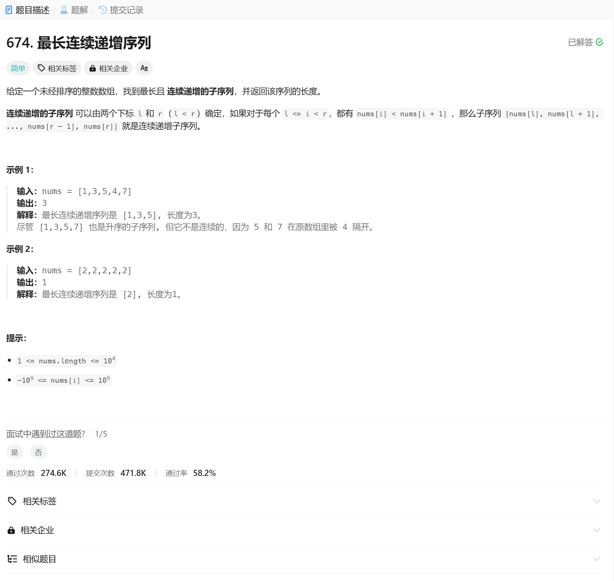

# 674. 最长连续递增序列
## 题目链接  
[674. 最长连续递增序列](https://leetcode.cn/problems/longest-continuous-increasing-subsequence/description/)
## 题目详情


***
## 解答一
答题者：EchoBai

### 题解
直接遍历，如果满足大小关系，则长度递增，否则长度直接等于0.

### 代码
``` cpp
class Solution {
public:
    int findLengthOfLCIS(vector<int>& nums) {
        int size = nums.size();
        int len = 0;
        int res = 0;
        for(int i = 1; i < size; ++i){
            if(nums[i - 1] < nums[i]){
                ++len;
            }else{
                len = 0;
            }
            res = std::max(res,len);
        }
        return res + 1;
    }
};
```
