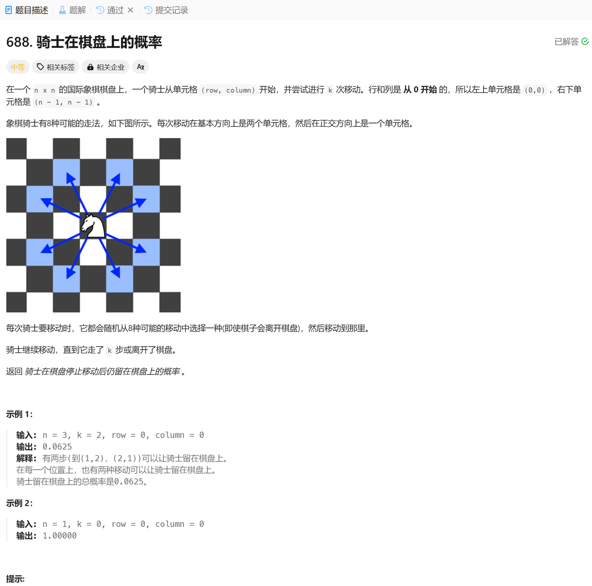

# 688. 骑士在棋盘上的概率
## 题目链接  
[688. 骑士在棋盘上的概率](https://leetcode.cn/problems/knight-probability-in-chessboard/description/?envType=daily-question&envId=2024-12-07)
## 题目详情


***
## 解答一
答题者：**EchoBai**

### 题解
>递归判断当马走到第0步时，是否还在棋盘上，定义八个方向的方向数组，然后从每个方向开始在递归判断从下一个位置开始到消耗完步数之后是否还在棋盘上，在的话计数++。最后所有方向探索完毕，次数除8得到概率。同时因为每次都要从一个方向向八个方向，为了避免重复参数造成的重复计算。引入一个记忆数组，记录入口数组的行列信息和返回值。

### 代码
``` Java
class Solution {
    static constexpr int DIRS[8][2] = {{2, 1}, {1, 2}, {-1, 2}, {-2, 1}, {-2, -1}, {-1, -2}, {1, -2}, {2, -1}};
public:
    double knightProbability(int n, int k, int row, int column) {
        vector<vector<vector<double>>> memo(k + 1, vector<vector<double>>(n, vector<double>(n)));
        auto dfs = [&](auto& dfs, int k, int i, int j) -> double {
            if (i < 0 || i >= n || j < 0 || j >= n) {
                return 0;
            }
            if (k == 0) {
                return 1;
            }
            double& res = memo[k][i][j]; // 记忆数组， 避免重复参数造成重复计算
            if (res) { 
                return res;
            }
            for (auto& [dx, dy] : DIRS) {
                res += dfs(dfs, k - 1, i + dx, j + dy);
            }
            res /= 8;
            return res;
        };
        return dfs(dfs, k, row, column);
    }
};
```
