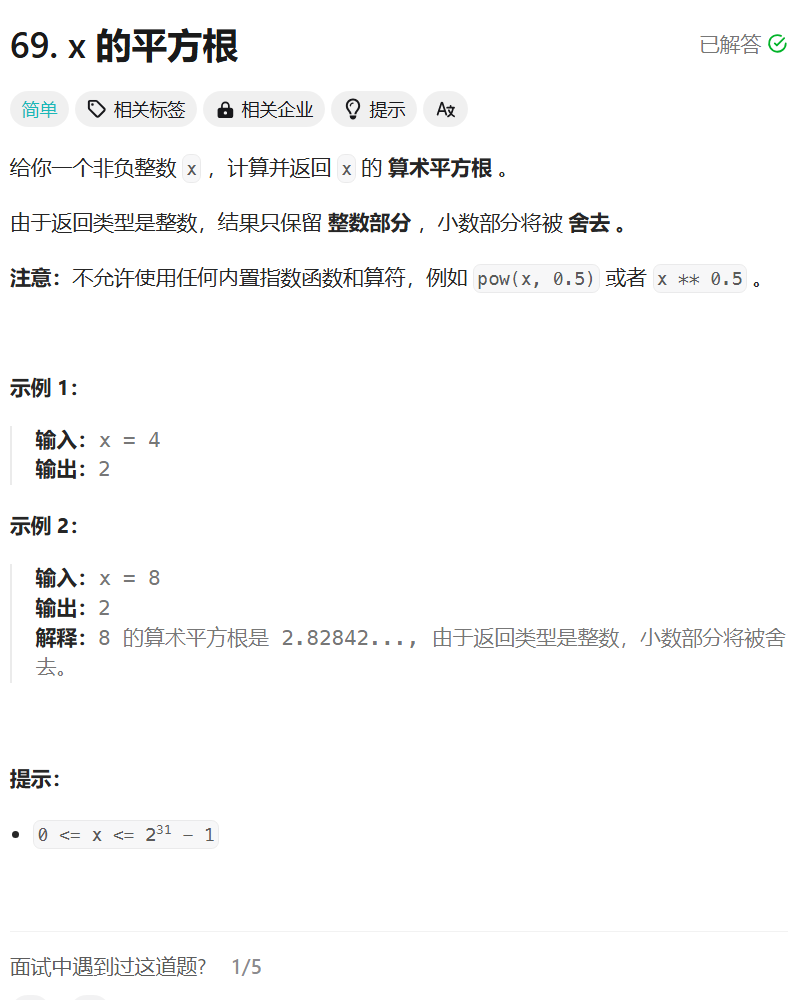

# 69. x的平方根
## 题目链接  
[69. x的平方根](https://leetcode.cn/problems/sqrtx/description/)
## 题目详情


## 解答一
答题者：**Yuiko630**

### 题解
>二分查找，注意right边界应为x / 2 + 1，且mid相乘可能超出int范围。

### 代码
``` Java
class Solution {
    public int mySqrt(int x) {
        int left = 0;
        int right = x / 2 + 1;
        int mid = (left + right) / 2;
        while(left <= right){
            if((long) mid * mid == x) return mid;
            else if((long) mid *mid > x) right = mid - 1;
            else left = mid + 1;
            mid = (left + right) / 2;
        }
        return mid;
    }
}
```
