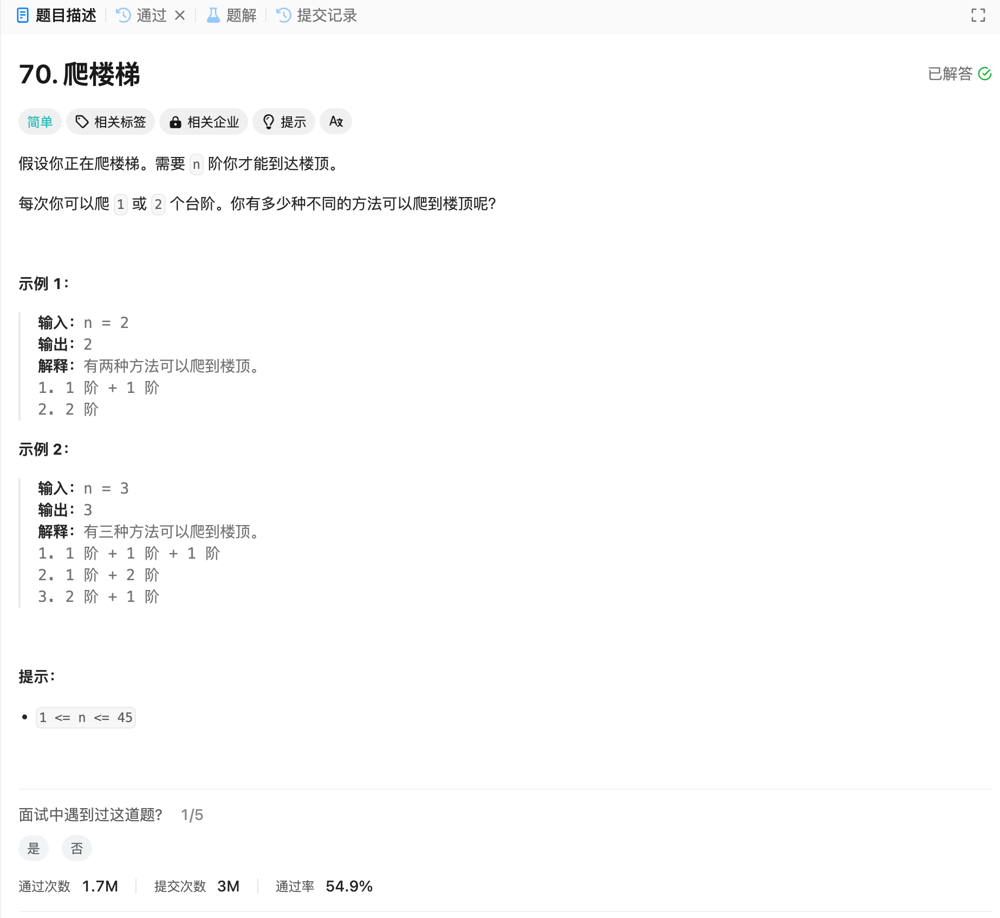

# 70. 爬楼梯
## 题目链接  
[70. 爬楼梯](https://leetcode.cn/problems/climbing-stairs/description/)
## 题目详情


***
## 解答一
答题者：EchoBai

### 题解
根据定义递推即可。

### 代码
``` cpp
class Solution {
public:
    int climbStairs(int n) {
        int dp0 = 1;
        int dp1 = 2;
        if(n <= 2) return n;
        for(int i = 3; i <= n; ++i){
            int sum = dp0 + dp1;
            dp0 = dp1;
            dp1 = sum;
        }
        return dp1;
    }
};
```


