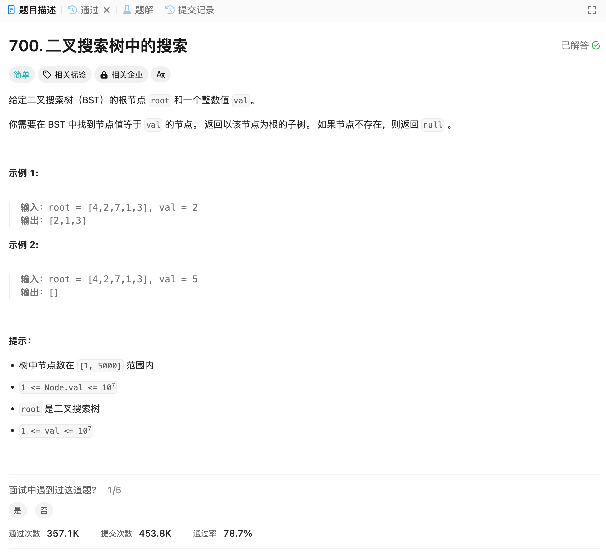

# 700. 二叉搜索树中的搜索
## 题目链接  
[700. 二叉搜索树中的搜索](https://leetcode.cn/problems/search-in-a-binary-search-tree/)
## 题目详情


***
## 解答一
答题者：EchoBai

### 题解
按照题意，递归搜索即可，注意由于是二叉搜素树，因此可以根据节点值大小关系判断应该在左子树还是右子树上搜素。

### 代码
``` cpp
/**
 * Definition for a binary tree node.
 * struct TreeNode {
 *     int val;
 *     TreeNode *left;
 *     TreeNode *right;
 *     TreeNode() : val(0), left(nullptr), right(nullptr) {}
 *     TreeNode(int x) : val(x), left(nullptr), right(nullptr) {}
 *     TreeNode(int x, TreeNode *left, TreeNode *right) : val(x), left(left), right(right) {}
 * };
 */
class Solution {
public:
    TreeNode* searchBST(TreeNode* root, int val) {
        if(!root) return nullptr;
        if(root->val == val) return root;
        else if(root->val > val) return searchBST(root->left, val);
        else return searchBST(root->right,val);
    }
};
```


