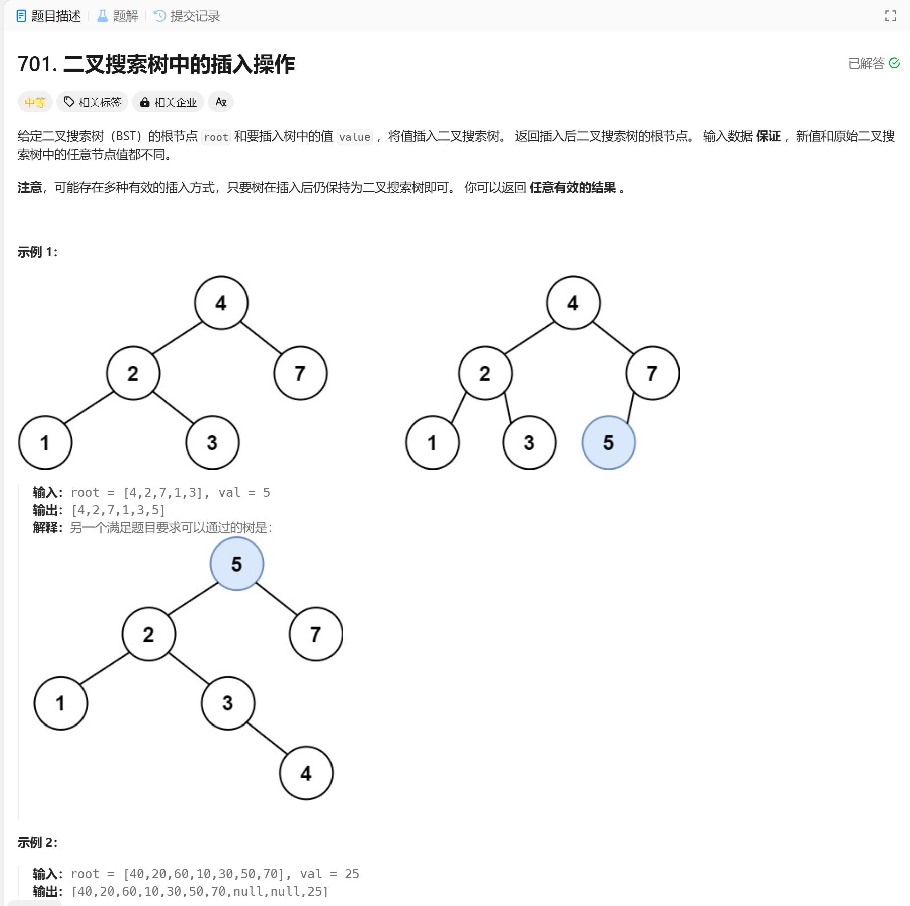

# 701. 二叉搜索树中的插入操作
## 题目链接  
[701. 二叉搜索树中的插入操作](https://leetcode.cn/problems/insert-into-a-binary-search-tree/)
## 题目详情


## 解答一
答题者：EchoBai

### 题解
后序遍历得到数组，加入新增元素，然后转为通过有序数组构造二叉搜素树，等爱心人出个简易写法，偷懒了。

### 代码
``` cpp
/**
 * Definition for a binary tree node.
 * struct TreeNode {
 *     int val;
 *     TreeNode *left;
 *     TreeNode *right;
 *     TreeNode() : val(0), left(nullptr), right(nullptr) {}
 *     TreeNode(int x) : val(x), left(nullptr), right(nullptr) {}
 *     TreeNode(int x, TreeNode *left, TreeNode *right) : val(x), left(left), right(right) {}
 * };
 */
class Solution {
public:
    TreeNode* insertIntoBST(TreeNode* root, int val) {
        vector<int> vt;
        travel(root,vt);
        vt.push_back(val);
        sort(vt.begin(),vt.end());
        return sortedArrayToBST(vt);
    }

    void travel(TreeNode* root, vector<int>& vt){
        if(!root) return;
        travel(root->left, vt);
        vt.push_back(root->val);  
        travel(root->right,vt);
    }

    TreeNode* sortedArrayToBST(vector<int>& nums) {
        int size = nums.size();
        if(size == 0)  
            return nullptr;
        if(size == 1)
            return new TreeNode(nums[size - 1]);
        TreeNode* root = new TreeNode(nums[size/2]);
        vector<int>left_nums,right_nums;
        for(int i = 0; i < size / 2; ++i){
            left_nums.push_back(nums[i]);
        }
        for(int i = size / 2 + 1; i < size; ++i){
            right_nums.push_back(nums[i]);
        }
        root->left = sortedArrayToBST(left_nums);
        root->right = sortedArrayToBST(right_nums);
        return root;
        
    }
};
```


