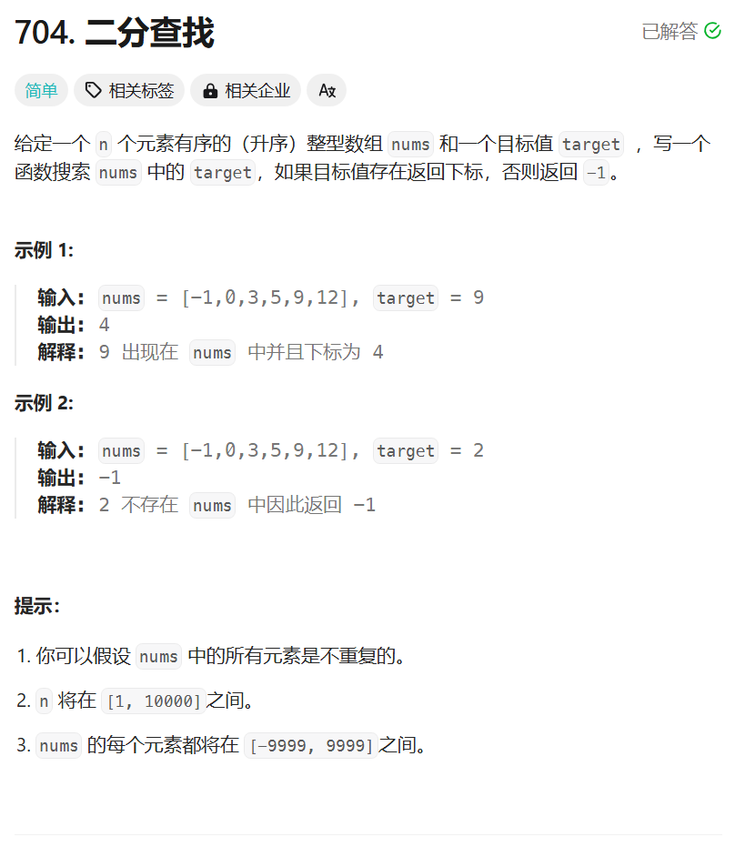

# 704. 二分查找
## 题目链接  
[704. 二分查找](https://leetcode.cn/problems/binary-search/description/)
## 题目详情


***
## 解答一
答题者：**Yuiko630**

### 题解
>二分查找循环不变量规则，right可取，则循环可相等，right=mid-1；right不可取，则循环不相等，right=mid。

### 代码
``` Java
class Solution {
    public int search(int[] nums, int target) {
        int left = 0;
        int right = nums.length - 1;
        int mid = (left+right) / 2;
        while(left <= right){
            if(nums[mid] == target) return mid;
            else if(nums[mid] > target) right = mid-1;
            else left = mid + 1;
            mid = (left+right) / 2;
        }
        return -1;
    }
}
```


