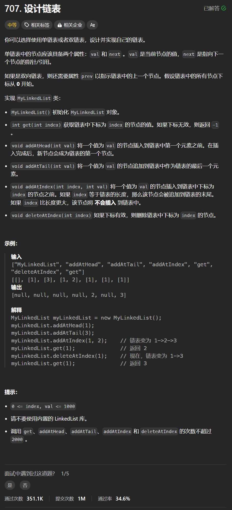

# 707. 设计链表
## 题目链接  
[707. 设计链表](https://leetcode.cn/problems/design-linked-list/description/)
## 题目详情


***
## 解答一
答题者：**Yuiko630**

### 题解
>注意初始化了虚拟头节点，寻找下标为index时，实际上是index+1，插入位置为index前，实际上是找index。

### 代码
``` Java
class ListNode {
    int val;
    ListNode next;
    ListNode(){};
    ListNode(int val){
        this.val = val;
    }
}
class MyLinkedList {
    int size;
    ListNode head;

    public MyLinkedList() {
        size = 0;
        head = new ListNode(0);
    }
    
    public int get(int index) {
        if(index < 0 || index >= this.size) return -1;
        ListNode cur = this.head;
        for(int i = 0; i <= index; i++){
            cur = cur.next;
        }
        return cur.val;
    }
    
    public void addAtHead(int val) {
        ListNode newHead = new ListNode(val);
        newHead.next = this.head.next;
        this.head.next = newHead;
        this.size++;
    }
    
    public void addAtTail(int val) {
        ListNode cur = this.head;
        while(cur.next != null){
            cur = cur.next;
        }
        ListNode newTail = new ListNode(val);
        cur.next = newTail;
        this.size++;
    }
    
    public void addAtIndex(int index, int val) {
        if(index > size) return;
        else if(index == size) addAtTail(val);
        else{
            if(index < 0) index = 0;
            ListNode newNode = new ListNode(val);
            ListNode cur = this.head;
            for(int i = 0; i < index; i++){
                cur = cur.next;
            }
            newNode.next = cur.next;
            cur.next = newNode;
            this.size++;
        }
        
    }
    
    public void deleteAtIndex(int index) {
        if(get(index) != -1){
            ListNode cur = this.head;
            int i = 0;
            while(cur.next != null){
                if(i == index){
                    cur.next = cur.next.next;
                    break;
                }
                else{
                    i++;
                    cur = cur.next;
                }
            }
            this.size--;
        }
    }
}

/**
 * Your MyLinkedList object will be instantiated and called as such:
 * MyLinkedList obj = new MyLinkedList();
 * int param_1 = obj.get(index);
 * obj.addAtHead(val);
 * obj.addAtTail(val);
 * obj.addAtIndex(index,val);
 * obj.deleteAtIndex(index);
 */
```


