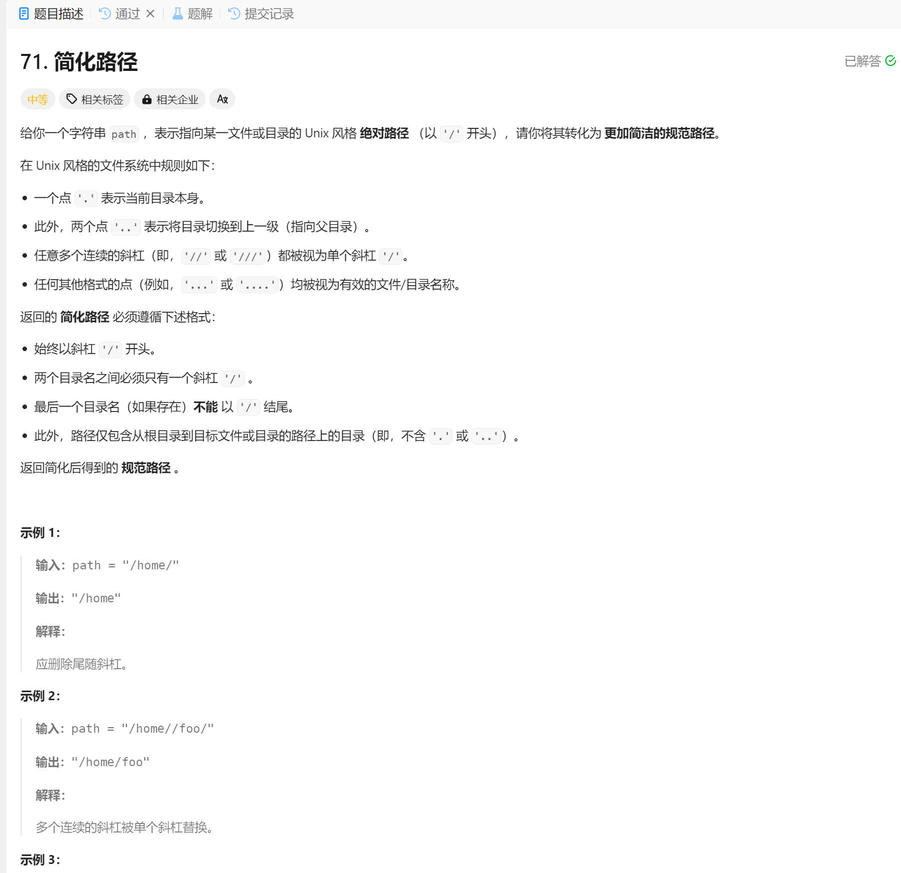

# 71. 简化路径
## 题目链接  
[71. 简化路径](https://leetcode.cn/problems/simplify-path/description/)
## 题目详情


***
## 解答一
答题者：EchoBai

### 题解
分割，然后用栈来存储每级目录，遇到..出栈即可。

### 代码
``` cpp
class Solution {
public:
    string simplifyPath(string path) {
        std::stack<std::string> st;
        std::string res, token;
        std::stringstream ss(path);

        while (std::getline(ss, token, '/')) {
            if (token == "." || token.empty()) {
                continue;
            } else if (token == "..") {
                if (!st.empty()) {
                    st.pop();
                }
            } else {
                st.push(token);
            }
        }

        while (!st.empty()) {
            res = "/" + st.top() + res;
            st.pop();
        }

        return res.empty() ? "/" : res;
    }
};
```
