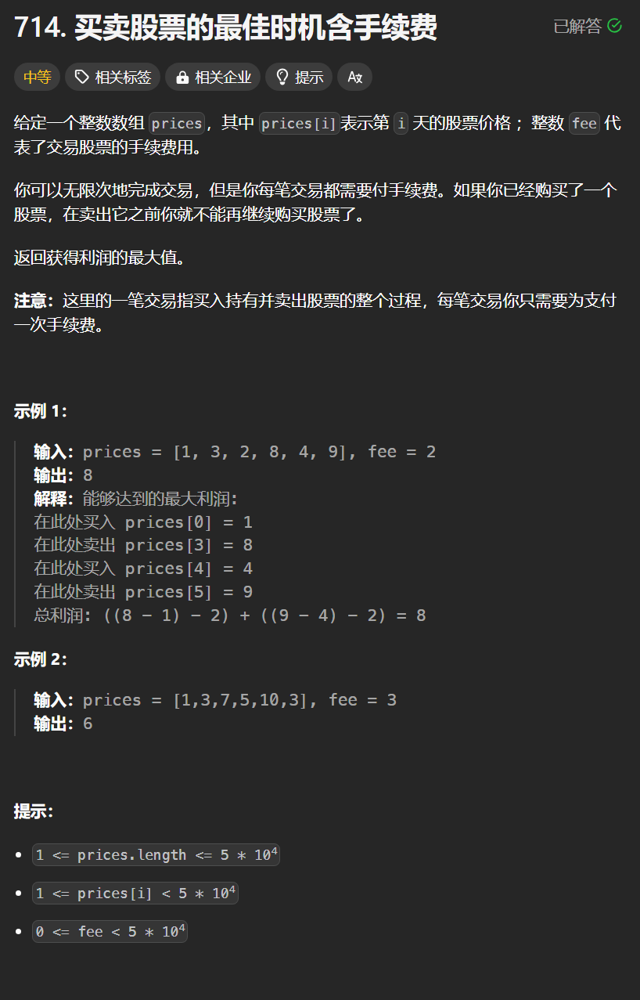

# 714. 买股票的最佳时机含手续费
## 题目链接  
[714. 买股票的最佳时机含手续费](https://leetcode.cn/problems/best-time-to-buy-and-sell-stock-with-transaction-fee/)
## 题目详情


***
## 解答一
答题者：**Yuiko630**

### 题解
>当前状态是由前面的状态决定的，dp，五部曲
>1. 定义:dp[i][2]，dp[i][0]表示第i天持有股票最多现金，dp[i][1]表示第i天不持有股票最多现金
>2. 转移方程:
> > 持有：dp[i][0]=max(dp[i-1][0], dp[1-1][1]-prices[i]-fee); 昨天持有或者昨天不持有今天买入
> > 不持有：dp[i][1]=max(dp[i-1][1], dp[i-1][0]+prices[i]); 昨天不持有或者昨天持有今天卖出
>3. 初始化:dp[0][0] = -prices[0]-fee;
>4. 遍历:正序遍历prices即可
>5. 推导

### 代码
``` java
class Solution {
    public int maxProfit(int[] prices, int fee) {
        int length = prices.length;
        int[][] dp = new int[length][2];
        dp[0][0] = -prices[0]-fee;
        for(int i = 1; i < length; i++){
            //买入
            dp[i][0] = Math.max(dp[i-1][0], dp[i-1][1] - prices[i] - fee);
            //卖出
            dp[i][1] = Math.max(dp[i-1][1], dp[i-1][0] + prices[i]);
        }
        return Math.max(dp[length-1][0], dp[length-1][1]);
    }
}
```