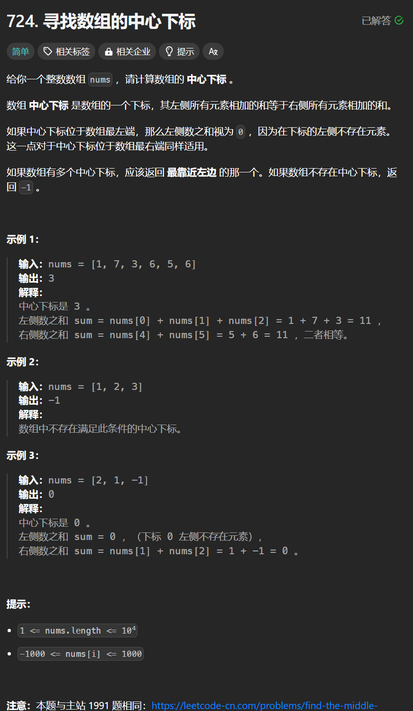

# 724. 寻找数组的中心下标
## 题目链接  
[724. 寻找数组的中心下标](https://leetcode.cn/problems/find-pivot-index/)
## 题目详情


***
## 解答一
答题者：**Yuiko630**

### 题解
>先求总和，然后遍历nums计算左和、右和。

### 代码
``` java
class Solution {
    public int pivotIndex(int[] nums) {
        int sum = 0;
        for(int num : nums){
            sum += num;
        }
        int leftSum = 0, rightSum = 0;
        for(int i = 0; i < nums.length; i++){
            if(i > 0) leftSum += nums[i - 1];
            rightSum = sum - leftSum - nums[i];
            if(leftSum == rightSum) return i;
        }
        return -1;
    }
}
```