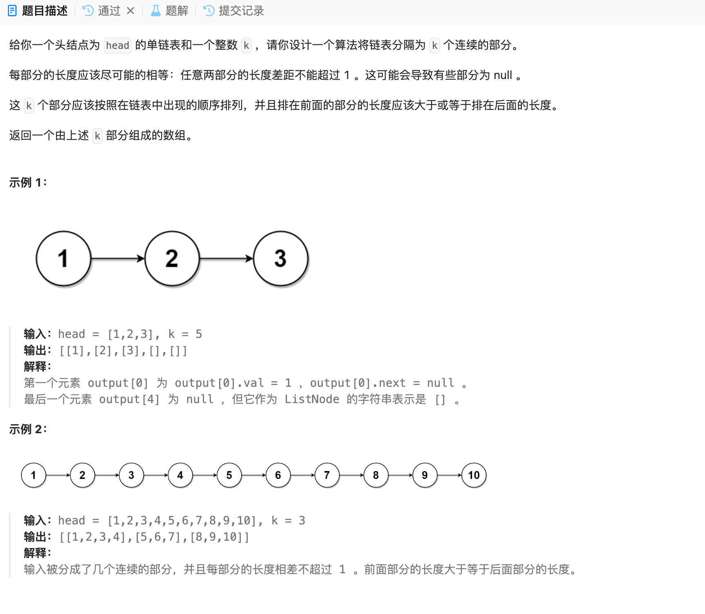

# 725. 分隔链表
## 题目链接  
[725. 分隔链表](https://leetcode.cn/problems/split-linked-list-in-parts/description/)
## 题目详情


***
## 解答一
答题者：EchoBai

### 题解
先计算链表长度，为了避免后续再次对链表进行遍历直接将链表节点放入vector中，然后计算划分的部分，剩余的部分，剩余部分必然不会超过划分部分，为满足题意依次在前面的几部分加1，最后串联起链表即可（也可以省去串联操作，在最开始直接放入链表节点，处理好尾部部分即可），注意考虑划分大于链表长度的情况，这样需在后面填入nullptr。

### 代码
``` cpp
/**
 * Definition for singly-linked list.
 * struct ListNode {
 *     int val;
 *     ListNode *next;
 *     ListNode() : val(0), next(nullptr) {}
 *     ListNode(int x) : val(x), next(nullptr) {}
 *     ListNode(int x, ListNode *next) : val(x), next(next) {}
 * };
 */
class Solution {
public:
    vector<ListNode*> splitListToParts(ListNode* head, int k) {
        std::vector<ListNode*> ret;
        if(k == 0){
            ret.emplace_back(head);
            return ret;
        }

        ListNode* p = head;
        std::vector<ListNode*> div;

        int len = 0;
        while(p) {
            ++len;
            ListNode* e = new ListNode(p->val);
            div.emplace_back(e);
            p = p->next;
        }

        int partNum = len / k;
        int remainNum = len % k;
        //std::cout << "part num: " << partNum << " remain num: " << remainNum << std::endl;

        int divPartNum = partNum;
        int i = 0;
        while(i < len){
            if(remainNum > 0){
                divPartNum = partNum + 1;
                --remainNum;
            }else{
                divPartNum = partNum;
            }
            ListNode* divPtr = new ListNode(-1);
            ret.emplace_back(div[i]);
            while(divPartNum > 0){
                divPtr->next = div[i];
                divPtr = divPtr->next;
                ++i;
                --divPartNum;
            }
            
        }
        // handle k > len(link)
        if(k > len){
            int remain = k - len;
            while(remain > 0){
                ret.emplace_back(nullptr);
                --remain;
            }
        }

        return ret;
    }
};
```
