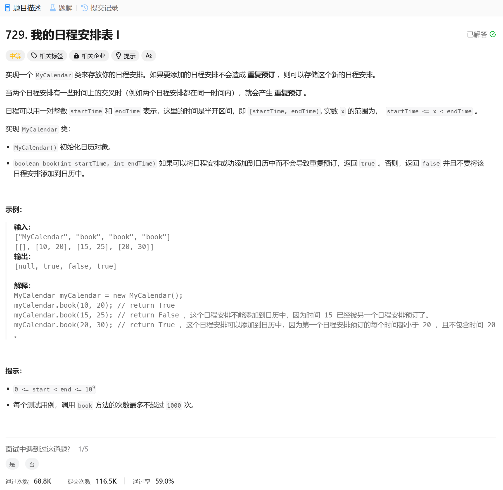

# 729. 我的日程安排表 I
## 题目链接  
[729. 我的日程安排表 I](https://leetcode.cn/problems/my-calendar-i/description/?envType=daily-question&envId=2025-01-02)
## 题目详情


***
## 解答一
答题者：EchoBai

### 题解
用一个vector用于存储日程，如果两个日常[s1, e1) [s2, e2)互不重复，那么有 s1 >= e2 || s2 >= e1 ，那么取反就是会重叠的 (s1 < e2) && (s2 < e1)。

### 代码
``` cpp
class MyCalendar {
private:
    std::vector<std::pair<int,int>> records;
public:
    MyCalendar() {
        
    }
    
    bool book(int startTime, int endTime) {
        for(const auto& [s, e] : records){
            // [s1, e1) [s2, e2) => s1 >= e2 || s2 >= e1 => (s1 < e2) && (s2 < e1)
            if(s < endTime && e > startTime){
                return false;
            }
        }
        records.emplace_back(startTime, endTime);
        return true;
    }
};

/**
 * Your MyCalendar object will be instantiated and called as such:
 * MyCalendar* obj = new MyCalendar();
 * bool param_1 = obj->book(startTime,endTime);
 */
```
