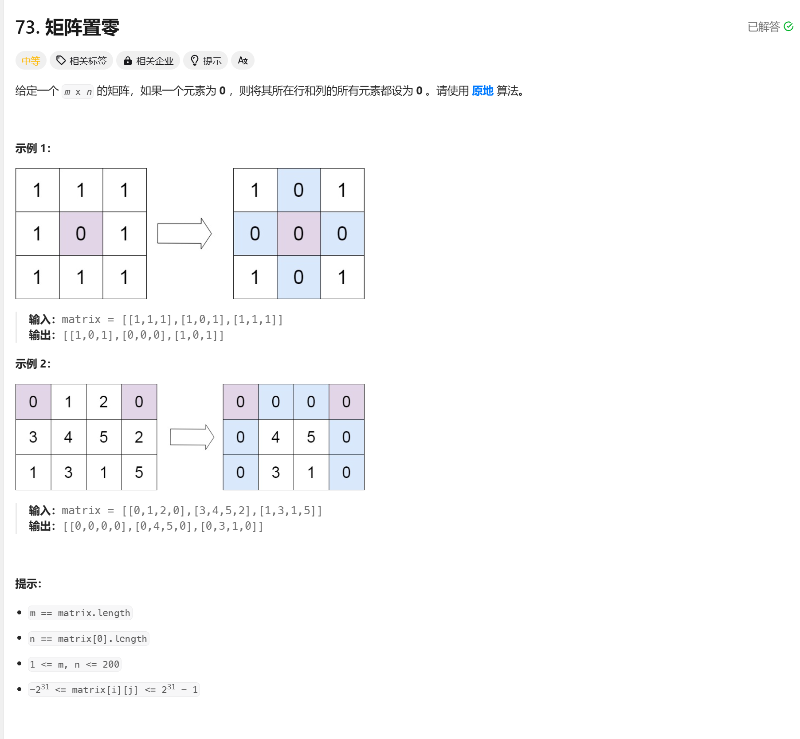

# 73. 矩阵置零
## 题目链接  
[73. 矩阵置零](https://leetcode.cn/problems/set-matrix-zeroes/description/)
## 题目详情


***
## 解答一
答题者：EchoBai

### 题解
先找出矩阵中所有0的位置，然后挨个取出对对应的行列置0即可。这样有个弊端就是当两个相同的0在同一行或者同一列则会重复遍历。

### 代码
``` cpp
class Solution {
public:
    void setZeroes(vector<vector<int>>& matrix) {
        vector<std::pair<int,int>> res = findZeroLocation(matrix);
        for(const auto& [row,col] : res){
            setZeroBaseLocation(matrix, row, col);
        }
    }

    void setZeroBaseLocation(vector<vector<int>>& matrix, int row, int col){
        for(int i = 0; i < matrix.size(); ++i){
            matrix[i][col] = 0;
        }
        for(int j = 0; j < matrix[row].size(); ++j){
            matrix[row][j] = 0;
        }
    }

    vector<std::pair<int,int>> findZeroLocation(vector<vector<int>>& matrix){
        vector<std::pair<int,int>> res;
        for(int i = 0; i < matrix.size(); ++i){
            for(int j = 0; j < matrix[i].size(); ++j){
                if(matrix[i][j] == 0){
                    res.push_back({i,j});
                }
            }
        }
        return res;
    }
};
```
