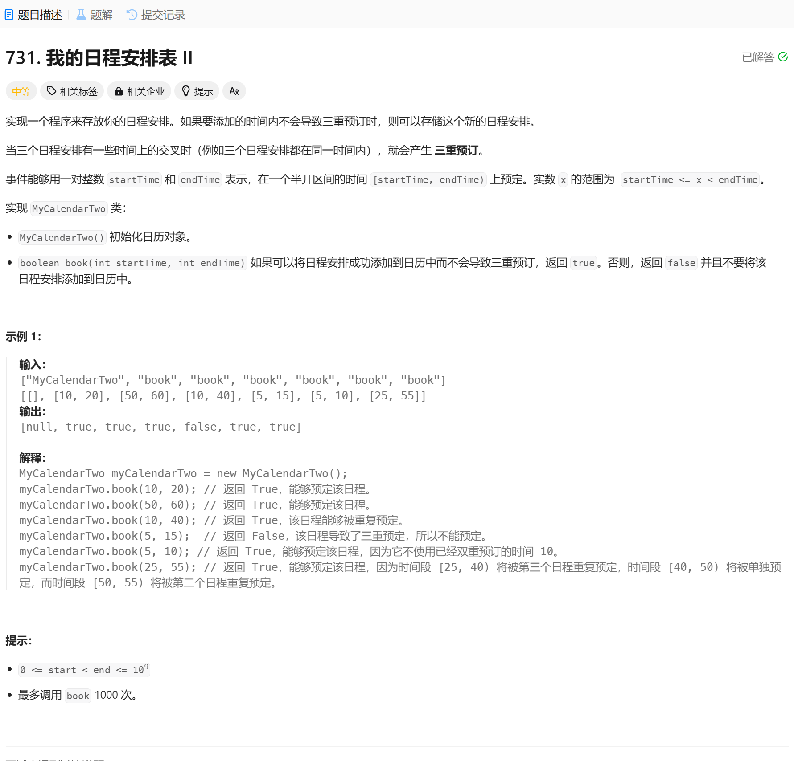

# 731. 我的日程安排表 II
## 题目链接  
[731. 我的日程安排表 II](https://leetcode.cn/problems/my-calendar-ii/?envType=daily-question&envId=2025-01-03)
## 题目详情


***
## 解答一
答题者：EchoBai

### 题解
用一个vector用于存储日程，如果两个日常[s1, e1) [s2, e2)互不重复，那么有 s1 >= e2 || s2 >= e1 ，那么取反就是会重叠的 (s1 < e2) && (s2 < e1)，在此基础上存储重叠的部分，如果下一个日程与重叠的日程重叠那就是三重重叠，不满足条件。

### 代码
``` cpp
class MyCalendarTwo {
    std::vector<std::pair<int,int>> records;
    std::vector<std::pair<int,int>> overlaps;
public:
    MyCalendarTwo() {
        
    }
    
    bool book(int startTime, int endTime) {

        for(const auto& r3 : overlaps){
            if(startTime < r3.second && r3.first < endTime){
                return false;
            }
        }

        for(const auto& r1 : records){
            // [s1, e1) [s2, e2) [s3, e3) => (s2 >= e1 || s1 >= e2)
            // [s1, e2) [s3, e3) => (s2 >= e1 && (s3 >= e2 || s1 >= e3))
            // [s2, e1) [s3, e3) => (s1 >= e2 && (s3 >= e1 || s2 >= e3))
            if(startTime < r1.second && r1.first < endTime){
                int s2 = std::max(r1.first, startTime);
                int e2 = std::min(r1.second, endTime);
                overlaps.emplace_back(s2,e2);
            }
        }
        records.emplace_back(startTime, endTime);
        return true;
    }
};

/**
 * Your MyCalendarTwo object will be instantiated and called as such:
 * MyCalendarTwo* obj = new MyCalendarTwo();
 * bool param_1 = obj->book(startTime,endTime);
 */
```
