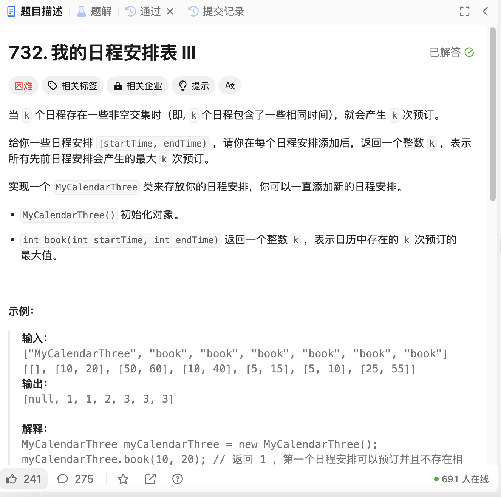

# 732. 我的日程安排表 III
## 题目链接  
[732. 我的日程安排表 III](https://leetcode.cn/problems/my-calendar-iii/description/?envType=daily-question&envId=2025-01-04)
## 题目详情


***
## 解答一
答题者：EchoBai

### 题解
差分数组，在开始处对日程++，结束处对日程--，这样如果存在重叠，考虑两个区间相互包含，两个左端点肯定先遍历到，能累积得到他们的结果，然后求出当前的最大值。

### 代码
``` cpp
class MyCalendarThree {
private:
    std::map<int, int> timeline;  

public:
    MyCalendarThree() {

    }

    int book(int startTime, int endTime) {
        timeline[startTime]++;
        timeline[endTime]--;

        int maxK = 0; 
        int currentK = 0; 

        for (const auto& [time, change] : timeline) {

            currentK += change;
            maxK = std::max(maxK, currentK);
        }
        return maxK;
    }
};
/**
 * Your MyCalendarThree object will be instantiated and called as such:
 * MyCalendarThree* obj = new MyCalendarThree();
 * int param_1 = obj->book(startTime,endTime);
 */
```
