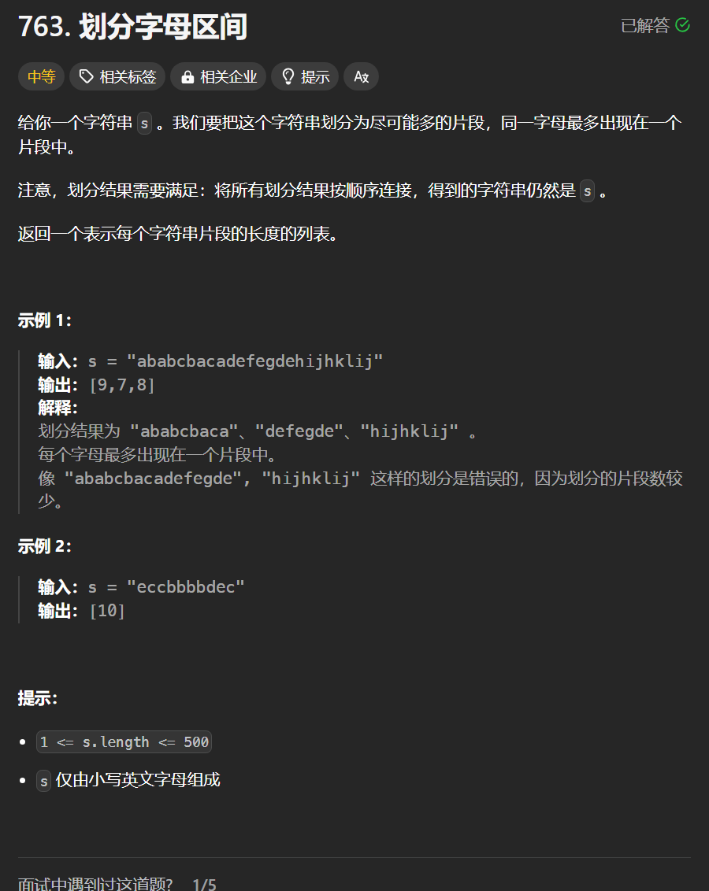

# 736. 划分字母区间
## 题目链接  
[736. 划分字母区间](https://leetcode.cn/problems/partition-labels/description/)
## 题目详情


***
## 解答一
答题者：**Yuiko630**

### 题解
>先统计每一个字符最后出现的位置，再从头遍历字符，记录最远下标，若当前位置==最远下标，则为分割点。

### 代码
``` Java
class Solution {
    public List<Integer> partitionLabels(String s) {
        int[] hash = new int[26];
        for(int i = 0; i < s.length(); i++){
            hash[s.charAt(i) - 'a'] =i;
        }
        List<Integer> result = new ArrayList<>();
        int start = 0;
        int end = 0;
        for(int i = 0; i < s.length(); i++){
            end = Math.max(end, hash[s.charAt(i) - 'a']);
            if(i == end){
                result.add(end - start + 1);
                start = i+1;
            }
        }
        return result;
    }
}
```